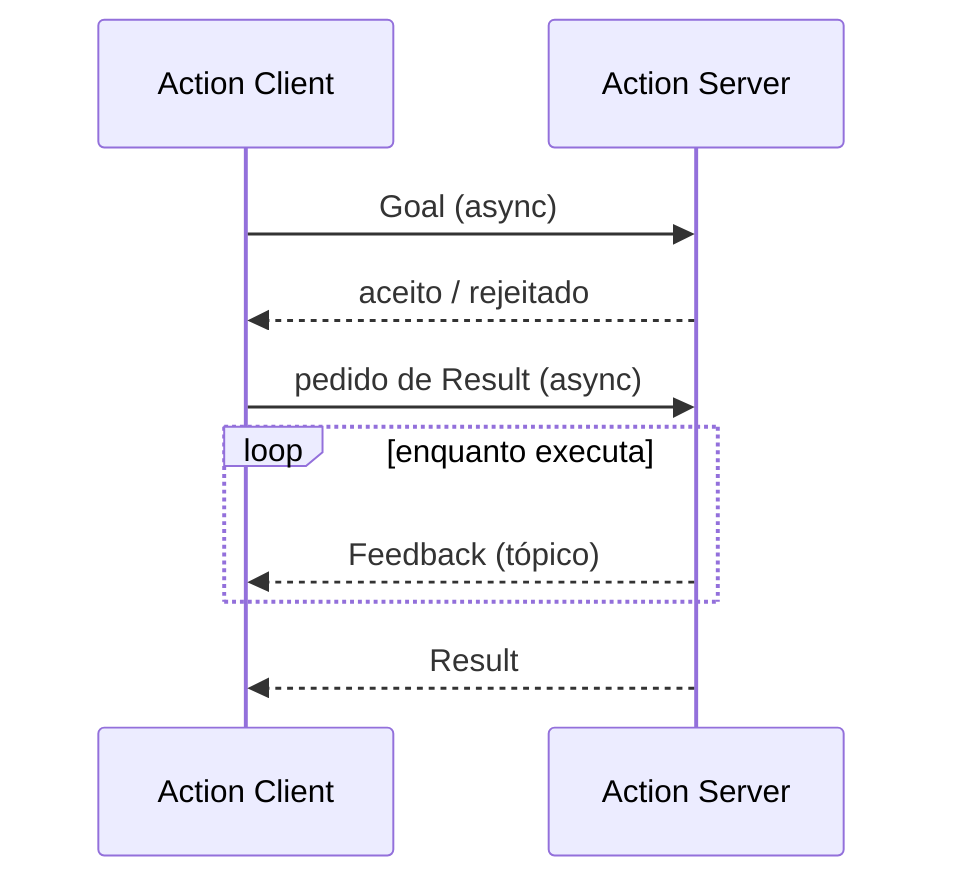
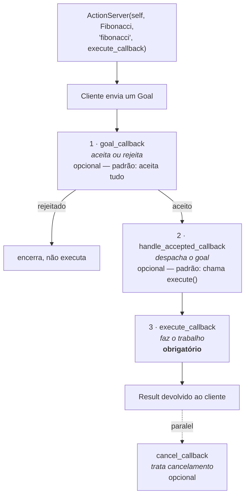

# Actions

*Para tarefas longas: que dão progresso, e que podem ser canceladas.*

---

## Como funciona

Uma action é construída **em cima** de serviços e tópicos:

- o **goal** é enviado por uma chamada assíncrona (serviço) e volta com um
  "aceito/rejeitado";
- o **result** é pedido por outra chamada assíncrona (serviço);
- o **feedback** é um **tópico**, publicado continuamente enquanto a tarefa
  acontece — por isso não precisa de `Future`.



---

## Definindo a interface

Actions moram em arquivos `.action`, num pacote `ament_cmake`:

```
# Request (goal)
---
# Result
---
# Feedback
```

Três blocos, **dois** separadores.

- **goal** — vai do cliente ao servidor, iniciando a tarefa;
- **result** — vai do servidor ao cliente quando a tarefa termina;
- **feedback** — vai do servidor ao cliente periodicamente, com o progresso.

Vamos usar Fibonacci como exemplo:

```bash
mkdir -p ros2_ws/src && cd ros2_ws/src
ros2 pkg create action_tutorials_interfaces
cd action_tutorials_interfaces
mkdir action
```

```
# action/Fibonacci.action
int32 order
---
int32[] sequence
---
int32[] partial_sequence
```

O goal é a ordem da sequência; o result é a sequência completa; o feedback é a
sequência parcial construída até agora.

### `CMakeLists.txt` e `package.xml`

```cmake
find_package(rosidl_default_generators REQUIRED)

rosidl_generate_interfaces(${PROJECT_NAME}
  "action/Fibonacci.action"
)
```

```xml
<buildtool_depend>rosidl_default_generators</buildtool_depend>
<depend>action_msgs</depend>
<member_of_group>rosidl_interface_packages</member_of_group>
```

Depois do build, o que existe é equivalente a:

```python
class Fibonacci:
    class Goal:
        order
    class Result:
        sequence
    class Feedback:
        partial_sequence
```

E o tipo se chama `action_tutorials_interfaces/action/Fibonacci`.

---

## O servidor

```bash
ros2 pkg create --build-type ament_python fibonacci
```

```python
import rclpy
from rclpy.action import ActionServer
from rclpy.node import Node

from action_tutorials_interfaces.action import Fibonacci


class FibonacciActionServer(Node):

    def __init__(self):
        super().__init__('fibonacci_action_server')
        self._action_server = ActionServer(
            self,
            Fibonacci,
            'fibonacci',
            self.execute_callback)

    def execute_callback(self, goal_handle):
        self.get_logger().info('Executing goal...')
        result = Fibonacci.Result()
        return result


def main(args=None):
    rclpy.init(args=args)
    fibonacci_action_server = FibonacciActionServer()
    rclpy.spin(fibonacci_action_server)


if __name__ == '__main__':
    main()
```

### O ciclo de vida dos callbacks

O construtor do `ActionServer` recebe quatro coisas: o nó, o tipo, o nome e o
`execute_callback`. Os **outros** callbacks não foram passados — e por isso usam
a implementação padrão.



Os três primeiros rodam **em sequência**, cada um num slot fixo do ciclo de
vida. No código acima só o `execute_callback` foi fornecido; os outros ficam
invisíveis porque usam as funções padrão.

### Testando

```bash
python3 fibonacci_action_server.py
```

```bash
ros2 action send_goal fibonacci \
  action_tutorials_interfaces/action/Fibonacci "{order: 5}"
```

### Calculando de verdade

```python
def execute_callback(self, goal_handle):
    self.get_logger().info('Executing goal...')

    seq = [0, 1]
    for i in range(1, goal_handle.request.order):
        seq.append(seq[i] + seq[i - 1])

    goal_handle.succeed()

    result = Fibonacci.Result()
    result.sequence = seq
    return result
```

!!! warning "Errata do cheat sheet"
    No original: `seq.append(seq[i] + seq[i-i])` — `i-i` é sempre zero, o que
    gera `0,1,1,1,1,...`. O certo é `i-1`. E o `goal_handle.succeed()` aparecia
    duas vezes, uma delas escrita `succed()`.

### Publicando feedback

```python
import time


def execute_callback(self, goal_handle):
    self.get_logger().info('Executing goal...')

    feedback_msg = Fibonacci.Feedback()
    feedback_msg.partial_sequence = [0, 1]

    for i in range(1, goal_handle.request.order):
        feedback_msg.partial_sequence.append(
            feedback_msg.partial_sequence[i] + feedback_msg.partial_sequence[i-1])
        self.get_logger().info(
            'Feedback: {0}'.format(feedback_msg.partial_sequence))
        goal_handle.publish_feedback(feedback_msg)
        time.sleep(1)

    goal_handle.succeed()

    result = Fibonacci.Result()
    result.sequence = feedback_msg.partial_sequence
    return result
```

O `time.sleep(1)` está ali só para a tarefa ficar longa o bastante para você
ver o feedback acontecendo.

---

## O cliente

Versão ingênua, para ver a mecânica:

```python
import rclpy
from rclpy.action import ActionClient
from rclpy.node import Node

from action_tutorials_interfaces.action import Fibonacci


class FibonacciActionClient(Node):

    def __init__(self):
        super().__init__('fibonacci_action_client')
        self._action_client = ActionClient(self, Fibonacci, 'fibonacci')

    def send_goal(self, order):
        goal_msg = Fibonacci.Goal()
        goal_msg.order = order
        self._action_client.wait_for_server()
        return self._action_client.send_goal_async(goal_msg)


def main(args=None):
    rclpy.init(args=args)
    action_client = FibonacciActionClient()
    future = action_client.send_goal(10)
    rclpy.spin_until_future_complete(action_client, future)
```

São **duas** chamadas assíncronas ao servidor: a primeira pergunta se o goal foi
aceito, a segunda busca o resultado. A versão completa encadeia as duas com
callbacks:

```python
class FibonacciActionClient(Node):

    def __init__(self):
        super().__init__('fibonacci_action_client')
        self._action_client = ActionClient(self, Fibonacci, 'fibonacci')

    def send_goal(self, order):
        goal_msg = Fibonacci.Goal()
        goal_msg.order = order
        self._action_client.wait_for_server()
        self._send_goal_future = self._action_client.send_goal_async(goal_msg)
        self._send_goal_future.add_done_callback(self.goal_response_callback)

    def goal_response_callback(self, future):
        goal_handle = future.result()
        if not goal_handle.accepted:
            self.get_logger().info('Goal rejected :(')
            return

        self.get_logger().info('Goal accepted :)')
        self._get_result_future = goal_handle.get_result_async()
        self._get_result_future.add_done_callback(self.get_result_callback)

    def get_result_callback(self, future):
        result = future.result().result
        self.get_logger().info('Result: {0}'.format(result.sequence))
        rclpy.shutdown()


def main(args=None):
    rclpy.init(args=args)
    action_client = FibonacciActionClient()
    action_client.send_goal(10)
    rclpy.spin(action_client)
```

Lendo com calma:

- `send_goal_async` devolve um `Future`. Quando o servidor responde,
  `add_done_callback` dispara `goal_response_callback`.
- Dentro dele, `future.result()` é um **`ClientGoalHandle`**. É esse objeto que
  sabe pedir o resultado, com `get_result_async()`.
- Em `get_result_callback`, `future.result()` tem duas propriedades: `result`
  (o `Fibonacci.Result()`, de onde sai `.sequence`) e `status`.

### Recebendo feedback

```python
self._send_goal_future = self._action_client.send_goal_async(
    goal_msg, feedback_callback=self.feedback_callback)
```

```python
def feedback_callback(self, feedback_msg):
    feedback = feedback_msg.feedback
    self.get_logger().info(
        'Received feedback: {0}'.format(feedback.partial_sequence))
```

---

## Exercícios

### Exercício 1 — Leitura do fluxo 🟢

**Objetivo:** saber onde cada coisa acontece antes de escrever.

**Especificação:** sem olhar o código, responda: em qual callback você
rejeitaria um goal com `order` negativo? Em qual você publicaria feedback? Onde
o `Result` é montado? Depois confira.

**✅ Aprovado se:** você acertou os três e sabe dizer qual deles é obrigatório.

### Exercício 2 — Contagem regressiva 🟢

**Objetivo:** uma action inteira do zero.

**Especificação:** crie a interface `Contagem.action` — goal `int32 de`, result
`string mensagem`, feedback `int32 restante`. O servidor conta de `de` até 0,
um por segundo, publicando feedback. Cliente com `--feedback` no terminal.

**✅ Aprovado se:** `ros2 action send_goal /contagem ... --feedback` mostra a
contagem descendo e termina com `SUCCEEDED`.

### Exercício 3 — Goal recusado 🟡

**Objetivo:** o `goal_callback` que o tutorial não usa.

**Especificação:** acrescente ao servidor de Fibonacci um `goal_callback` que
rejeita `order > 20`. O cliente precisa tratar a rejeição sem quebrar.

**✅ Aprovado se:** `order: 25` imprime "Goal rejected" no cliente e o servidor
nunca entra no `execute_callback`.

??? tip "Dica"
    O `goal_callback` recebe o goal e retorna `GoalResponse.ACCEPT` ou
    `GoalResponse.REJECT` (de `rclpy.action`). Passe-o como argumento nomeado no
    construtor do `ActionServer`.

### Exercício 4 — Cancelamento 🟠

**Objetivo:** a razão de existir das actions.

**Especificação:** faça a contagem regressiva do Ex. 2 poder ser cancelada no
meio. O servidor precisa checar `goal_handle.is_cancel_requested` no laço,
chamar `goal_handle.canceled()` e devolver um result parcial.

**✅ Aprovado se:** `Ctrl+C` no cliente encerra o goal com status `CANCELED`
(não `ABORTED`), e o servidor continua vivo aceitando um goal novo.

### Exercício 5 — Action + tf2 🔴

**Objetivo:** juntar dois capítulos.

**Especificação:** uma action `IrAte` que recebe um ponto (x, y) e leva a
`turtle1` até lá, publicando como feedback a distância restante — usando a
fórmula de controle do capítulo de [tf2](11-tf2.md). O goal termina quando a
distância for menor que 0,1.

**✅ Aprovado se:** a tartaruga chega, o feedback decresce monotonicamente e o
result traz a distância final.
