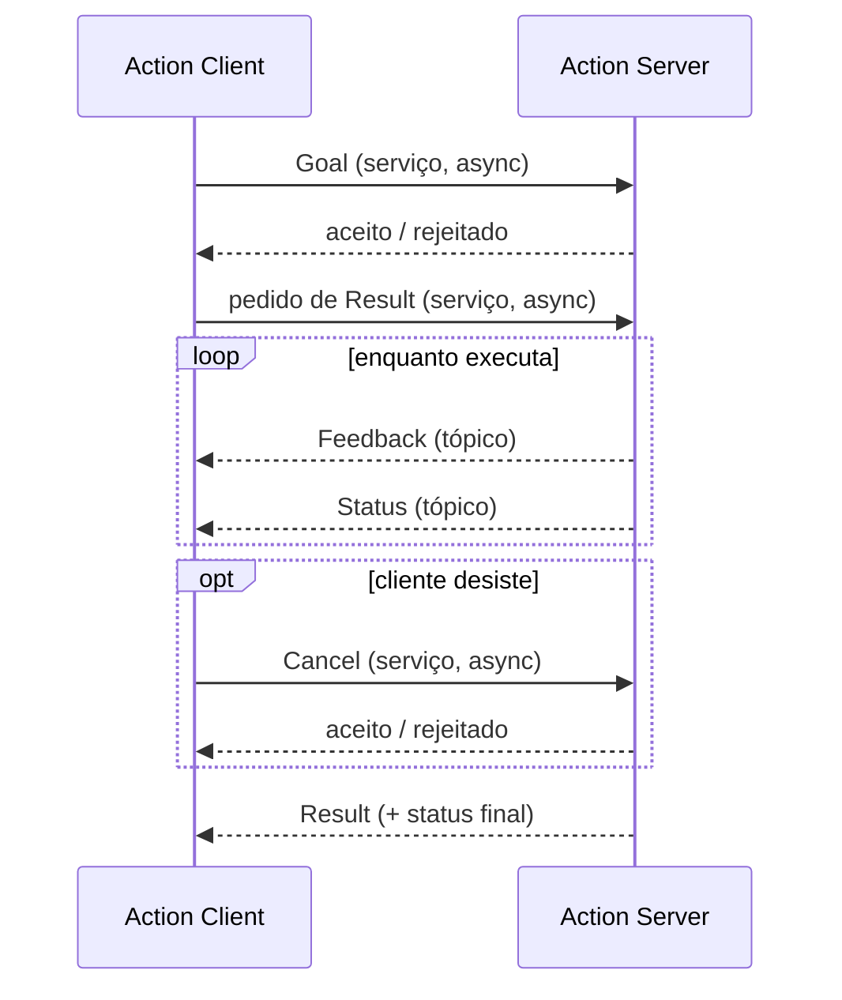
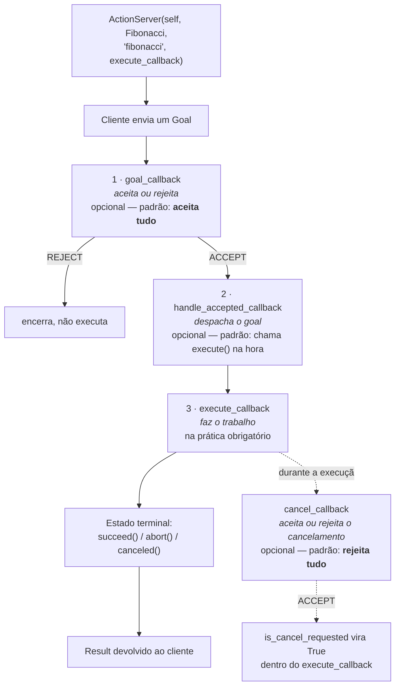

# Actions

*Para tarefas longas: que dão progresso, e que podem ser canceladas.*

---

## Onde está a documentação

Antes de escrever qualquer linha: **tudo sobre actions em Python — a classe
`ActionServer`, a classe `ActionClient`, os quatro callbacks do servidor, os
estados do goal e o fluxo completo — está na página de API do `rclpy`**:

<https://docs.ros2.org/foxy/api/rclpy/api/actions.html>

Essa é a página que reúne servidor e cliente num lugar só, e é a referência
que você vai reabrir toda vez que esquecer a assinatura de alguma coisa.

Quando precisar do detalhe de um objeto específico que aparece nos códigos
abaixo, use estas quatro:

| Quando você não entender… | Vá em |
|---|---|
| `def goal_response_callback(self, future)` — **o que é esse `future`**, o que ele tem dentro, o que é `add_done_callback` | [`rclpy.task`](https://docs.ros.org/en/iron/p/rclpy/rclpy.task.html) |
| `def execute_callback(self, goal_handle)` — **o que é esse `goal_handle`**, quais métodos ele tem (`succeed`, `abort`, `canceled`, `publish_feedback`, `is_cancel_requested`, `request`) | [`rclpy.action.server`](https://docs.ros.org/en/kilted/p/rclpy/rclpy.action.server.html) |
| O lado do cliente: `send_goal_async`, `ClientGoalHandle`, `cancel_goal_async`, `get_result_async` | [`rclpy.action.client`](https://docs.ros.org/en/iron/p/rclpy/rclpy.action.client.html) |
| A visão geral, servidor + cliente na mesma página | [`rclpy` actions (API)](https://docs.ros2.org/foxy/api/rclpy/api/actions.html) |

!!! note "Por que links de Foxy, Iron e Kilted num livro de Humble?"
    Porque a API do `rclpy` para actions **não mudou** entre essas distros: os
    mesmos quatro callbacks, os mesmos métodos do goal handle. O que muda é o
    layout do site — nas distros novas cada módulo ganhou uma página própria,
    com o texto mais completo, e é por isso que os links acima apontam para lá.

    A versão oficial do **Humble** está em
    <https://docs.ros.org/en/humble/p/rclpy/> (índice de módulos em
    [`/api.html`](https://docs.ros.org/en/humble/p/rclpy/api.html)). Use-a como
    fonte da verdade quando houver dúvida, e as outras como leitura.

E os tutoriais narrativos, que são complementares à API:

- [Understanding actions (CLI)](https://docs.ros.org/en/humble/Tutorials/Beginner-CLI-Tools/Understanding-ROS2-Actions/Understanding-ROS2-Actions.html)
- [Creating an action](https://docs.ros.org/en/humble/Tutorials/Intermediate/Creating-an-Action.html)
- [Writing an action server and client (Python)](https://docs.ros.org/en/humble/Tutorials/Intermediate/Writing-an-Action-Server-Client/Py.html)
- [Writing an action server and client (C++)](https://docs.ros.org/en/humble/Tutorials/Intermediate/Writing-an-Action-Server-Client/Cpp.html)
  — leia mesmo trabalhando em Python: **é a única versão do tutorial que
  explica os callbacks de aceitação e cancelamento**. Os nomes mapeiam 1:1
  (`handle_goal` → `goal_callback`, `handle_cancel` → `cancel_callback`,
  `handle_accepted` → `handle_accepted_callback`).

---

## Como funciona

Uma action é construída **em cima** de serviços e tópicos. Não é uma coisa nova
no meio da pilha — é uma convenção montada com o que você já conhece:

| Peça | Mecanismo | Tópico/serviço real |
|---|---|---|
| enviar o goal | serviço | `/<action>/_action/send_goal` |
| pedir o result | serviço | `/<action>/_action/get_result` |
| **pedir cancelamento** | serviço | `/<action>/_action/cancel_goal` |
| feedback | tópico | `/<action>/_action/feedback` |
| **status de todos os goals** | tópico | `/<action>/_action/status` |

São **três serviços e dois tópicos** — e você pode ver todos eles com
`ros2 topic list --include-hidden-topics` enquanto um servidor está no ar.

O feedback é tópico, e por isso não precisa de `Future`: ele simplesmente
chega. Já goal, cancelamento e result são chamadas assíncronas, e cada uma
devolve um `Future`.



---

## Definindo a interface

Actions moram em arquivos `.action`, num pacote `ament_cmake`:

```
# Request (goal)
---
# Result
---
# Feedback
```

Três blocos, **dois** separadores.

- **goal** — vai do cliente ao servidor, iniciando a tarefa;
- **result** — vai do servidor ao cliente quando a tarefa termina;
- **feedback** — vai do servidor ao cliente periodicamente, com o progresso.

Vamos usar Fibonacci como exemplo:

```bash
mkdir -p ros2_ws/src && cd ros2_ws/src
ros2 pkg create --build-type ament_cmake action_tutorials_interfaces
cd action_tutorials_interfaces
mkdir action
```

```
# action/Fibonacci.action
int32 order
---
int32[] sequence
---
int32[] partial_sequence
```

O goal é a ordem da sequência; o result é a sequência completa; o feedback é a
sequência parcial construída até agora.

!!! note "Diferenças de nome entre distros"
    O tutorial oficial do **Humble** usa o pacote `action_tutorials_interfaces`
    (é o nome adotado aqui). Do **Jazzy** em diante ele foi renomeado para
    `custom_action_interfaces`. É só o nome do pacote — o conteúdo é idêntico.
    Em versões recentes do `ros2 pkg create` existe também a flag
    `--license Apache-2.0`, que evita um aviso no `colcon build`.

### `CMakeLists.txt` e `package.xml`

```cmake
find_package(rosidl_default_generators REQUIRED)

rosidl_generate_interfaces(${PROJECT_NAME}
  "action/Fibonacci.action"
)
```

```xml
<buildtool_depend>rosidl_default_generators</buildtool_depend>
<depend>action_msgs</depend>
<member_of_group>rosidl_interface_packages</member_of_group>
```

Depois do build, o que existe é equivalente a:

```python
class Fibonacci:
    class Goal:
        order
    class Result:
        sequence
    class Feedback:
        partial_sequence
```

E o tipo se chama `action_tutorials_interfaces/action/Fibonacci`.

Confira com:

```bash
ros2 interface show action_tutorials_interfaces/action/Fibonacci
```

---

## O servidor

```bash
ros2 pkg create --build-type ament_python fibonacci
```

```python
import rclpy
from rclpy.action import ActionServer
from rclpy.node import Node

from action_tutorials_interfaces.action import Fibonacci


class FibonacciActionServer(Node):

    def __init__(self):
        super().__init__('fibonacci_action_server')
        self._action_server = ActionServer(
            self,
            Fibonacci,
            'fibonacci',
            self.execute_callback)

    def execute_callback(self, goal_handle):
        self.get_logger().info('Executing goal...')
        result = Fibonacci.Result()
        return result


def main(args=None):
    rclpy.init(args=args)
    fibonacci_action_server = FibonacciActionServer()
    rclpy.spin(fibonacci_action_server)


if __name__ == '__main__':
    main()
```

### O ciclo de vida dos callbacks

O construtor do `ActionServer` recebe quatro coisas posicionais: o nó, o tipo,
o nome e o `execute_callback`. Os **outros** callbacks não foram passados — e
por isso usam a implementação padrão.

A assinatura completa, direto da
[API](https://docs.ros2.org/foxy/api/rclpy/api/actions.html), com os defaults
que interessam:

```python
ActionServer(
    node,
    action_type,
    action_name,
    execute_callback,
    *,
    callback_group=None,
    goal_callback=default_goal_callback,                      # aceita TUDO
    handle_accepted_callback=default_handle_accepted_callback, # executa na hora
    cancel_callback=default_cancel_callback,                   # REJEITA TUDO
    result_timeout=900,
)
```



Os três primeiros rodam **em sequência**, cada um num slot fixo do ciclo de
vida. O `cancel_callback` é o único que roda **em paralelo** ao trabalho.

!!! danger "Os dois defaults que mordem"
    - `goal_callback` padrão **aceita qualquer goal**, inclusive lixo. Se o seu
      servidor precisa validar entrada, você *tem* que escrever esse callback.
    - `cancel_callback` padrão **rejeita qualquer cancelamento**. Se você não
      escrever esse callback, `is_cancel_requested` nunca vira `True` e sua
      action é, na prática, incancelável — que é justamente a coisa que
      diferencia uma action de um serviço.

### Testando

```bash
python3 fibonacci_action_server.py
```

```bash
ros2 action send_goal fibonacci \
  action_tutorials_interfaces/action/Fibonacci "{order: 5}"
```

Ferramentas de inspeção que valem decorar agora, porque você vai usá-las
contra o Nav2 depois:

```bash
ros2 action list -t                 # actions no ar, com o tipo
ros2 action info /fibonacci -t      # quem é cliente, quem é servidor
ros2 action send_goal --feedback ...  # mostra o feedback no terminal
```

### Calculando de verdade

```python
def execute_callback(self, goal_handle):
    self.get_logger().info('Executing goal...')

    seq = [0, 1]
    for i in range(1, goal_handle.request.order):
        seq.append(seq[i] + seq[i - 1])

    goal_handle.succeed()

    result = Fibonacci.Result()
    result.sequence = seq
    return result
```

!!! warning "Errata do cheat sheet"
    No original: `seq.append(seq[i] + seq[i-i])` — `i-i` é sempre zero, o que
    gera `0,1,1,1,1,...`. O certo é `i-1`. E o `goal_handle.succeed()` aparecia
    duas vezes, uma delas escrita `succed()`.

### Os três estados terminais

Todo goal aceito **precisa** terminar num destes três estados. Se você esquecer,
a documentação do Humble avisa: *o estado do goal não definido no execute
callback assume `aborted` por padrão* — e o servidor loga um warning.

| Método | Status final | Quando usar |
|---|---|---|
| `goal_handle.succeed()` | `STATUS_SUCCEEDED` (4) | a tarefa terminou como pedido |
| `goal_handle.abort()` | `STATUS_ABORTED` (6) | falhou: não deu para completar |
| `goal_handle.canceled()` | `STATUS_CANCELED` (5) | o cliente pediu para parar e você obedeceu |

Isso **não** é detalhe acadêmico: o Nav2 aborta um `NavigateToPose` com enorme
frequência (planner não achou caminho, controller travou, goal fora do mapa).
Um cliente que só trata sucesso vai parecer travado no seu robô.

```python
def execute_callback(self, goal_handle):
    order = goal_handle.request.order

    try:
        seq = self._compute(order)
    except Exception as e:                 # nunca deixe uma exceção escapar
        self.get_logger().error(f'Falhou: {e}')
        goal_handle.abort()                # <- terminal, sempre
        return Fibonacci.Result()          # result vazio, mas result

    goal_handle.succeed()
    result = Fibonacci.Result()
    result.sequence = seq
    return result
```

### Publicando feedback

```python
import time


def execute_callback(self, goal_handle):
    self.get_logger().info('Executing goal...')

    feedback_msg = Fibonacci.Feedback()
    feedback_msg.partial_sequence = [0, 1]

    for i in range(1, goal_handle.request.order):
        feedback_msg.partial_sequence.append(
            feedback_msg.partial_sequence[i] + feedback_msg.partial_sequence[i - 1])
        self.get_logger().info(
            'Feedback: {0}'.format(feedback_msg.partial_sequence))
        goal_handle.publish_feedback(feedback_msg)
        time.sleep(1)

    goal_handle.succeed()

    result = Fibonacci.Result()
    result.sequence = feedback_msg.partial_sequence
    return result
```

O `time.sleep(1)` está ali só para a tarefa ficar longa o bastante para você
ver o feedback acontecendo.

!!! danger "Esse `time.sleep()` é uma bomba-relógio"
    Com o executor padrão (single-threaded) e o callback group padrão
    (`MutuallyExclusiveCallbackGroup`), esse `sleep` **bloqueia o nó inteiro**.
    Enquanto ele dorme, nenhum outro callback roda — inclusive o
    `cancel_callback`. É por isso que, no código acima, um pedido de
    cancelamento simplesmente não chega.

    A correção está mais abaixo, em [Executores e callback
    groups](#executores-e-callback-groups). É o erro nº 1 de quem escreve seu
    primeiro servidor, e está documentado no próprio repositório de exemplos do
    ROS 2 ([`ros2/examples#271`](https://github.com/ros2/examples/issues/271)).

### Aceitando e rejeitando goals

```python
from rclpy.action import ActionServer, GoalResponse


class FibonacciActionServer(Node):

    def __init__(self):
        super().__init__('fibonacci_action_server')
        self._action_server = ActionServer(
            self,
            Fibonacci,
            'fibonacci',
            execute_callback=self.execute_callback,
            goal_callback=self.goal_callback)

    def goal_callback(self, goal_request):
        """Aceita ou rejeita um pedido do cliente. Recebe o GOAL, não o handle."""
        if goal_request.order < 1 or goal_request.order > 20:
            self.get_logger().warn(f'Rejeitando order={goal_request.order}')
            return GoalResponse.REJECT
        return GoalResponse.ACCEPT
```

Repare na pegadinha: o `goal_callback` recebe **o goal** (`goal_request.order`),
enquanto o `execute_callback` recebe **o handle** (`goal_handle.request.order`).
São objetos diferentes, e trocar um pelo outro é o erro mais comum aqui.

Um goal rejeitado nunca chega ao `execute_callback` — não existe estado
terminal para ele, porque ele nunca existiu.

### Cancelamento

Três peças, e as três precisam estar presentes:

```python
from rclpy.action import ActionServer, CancelResponse, GoalResponse


class ContagemActionServer(Node):

    def __init__(self):
        super().__init__('contagem_action_server')
        self._action_server = ActionServer(
            self,
            Contagem,
            'contagem',
            execute_callback=self.execute_callback,
            goal_callback=self.goal_callback,
            cancel_callback=self.cancel_callback)      # 1. registrar

    def cancel_callback(self, goal_handle):
        """Aceita ou rejeita um pedido de cancelamento."""
        self.get_logger().info('Pedido de cancelamento recebido')
        return CancelResponse.ACCEPT                    # 2. aceitar

    def execute_callback(self, goal_handle):
        feedback = Contagem.Feedback()
        result = Contagem.Result()

        for restante in range(goal_handle.request.de, -1, -1):
            if goal_handle.is_cancel_requested:         # 3. verificar no laço
                goal_handle.canceled()
                result.mensagem = f'Cancelado em {restante}'
                return result

            feedback.restante = restante
            goal_handle.publish_feedback(feedback)
            time.sleep(1.0)

        goal_handle.succeed()
        result.mensagem = 'Contagem concluída'
        return result
```

Esqueça **qualquer uma** das três e o cancelamento não acontece — sem erro,
sem log, sem nada. Faltou registrar: o handle nem recebe o pedido. Faltou
aceitar: `is_cancel_requested` fica eternamente `False`. Faltou verificar: o
servidor ignora e termina em `SUCCEEDED`.

### Um goal por vez (o padrão do Nav2)

Por padrão o servidor aceita quantos goals quiser, todos em paralelo. Não é isso
que você quer num robô: se um goal novo chega, o antigo tem que morrer. Esse é
exatamente o comportamento do `NavigateToPose`, e é o que o exemplo oficial
`server_single_goal.py` implementa:

```python
import threading

from rclpy.action import ActionServer, CancelResponse, GoalResponse
from rclpy.callback_groups import ReentrantCallbackGroup


class SingleGoalServer(Node):

    def __init__(self):
        super().__init__('single_goal_server')
        self._goal_handle = None
        self._goal_lock = threading.Lock()
        self._action_server = ActionServer(
            self,
            Contagem,
            'contagem',
            execute_callback=self.execute_callback,
            goal_callback=self.goal_callback,
            handle_accepted_callback=self.handle_accepted_callback,
            cancel_callback=self.cancel_callback,
            callback_group=ReentrantCallbackGroup())

    def goal_callback(self, goal_request):
        return GoalResponse.ACCEPT

    def handle_accepted_callback(self, goal_handle):
        """Aborta o goal anterior antes de executar o novo."""
        with self._goal_lock:
            if self._goal_handle is not None and self._goal_handle.is_active:
                self.get_logger().info('Abortando goal anterior')
                self._goal_handle.abort()
            self._goal_handle = goal_handle
        goal_handle.execute()          # <- só agora o execute_callback roda

    def cancel_callback(self, goal_handle):
        return CancelResponse.ACCEPT
```

Duas coisas novas aqui, e ambas importam:

- **`handle_accepted_callback`** é o slot onde você decide *quando* o goal
  roda. O padrão chama `execute()` imediatamente; ao fornecer o seu, você
  ganha o direito de adiar, enfileirar ou — como acima — matar o anterior.
  Segundo a API, esse callback recebe um `ServerGoalHandle`, que serve para
  publicar feedback, atualizar o status ou **executar um goal adiado**.
- **`goal_handle.execute()`** é o que dispara o `execute_callback`. Se você
  fornecer `handle_accepted_callback` e esquecer de chamar `execute()`, o goal
  fica aceito para sempre e nunca roda.

### Executores e callback groups

O `ReentrantCallbackGroup` acima não é enfeite. A regra é simples:

> Se o seu `execute_callback` demora (e ele demora, senão você usaria um
> serviço), ele precisa rodar num **`MultiThreadedExecutor`** com um
> **`ReentrantCallbackGroup`** — senão o `cancel_callback` nunca é atendido.

```python
from rclpy.executors import MultiThreadedExecutor


def main(args=None):
    rclpy.init(args=args)
    node = SingleGoalServer()

    executor = MultiThreadedExecutor()
    rclpy.spin(node, executor=executor)

    node.destroy_node()
    rclpy.shutdown()
```

O mesmo raciocínio vale do lado do cliente, e lá o sintoma é pior: chamar
`spin_until_future_complete()` **dentro de um callback** trava o nó para sempre
com o executor de thread única. Isso vai te acontecer no primeiro nó de missão
que enviar goals ao Nav2.

Leitura obrigatória depois deste capítulo:
[About Executors](https://docs.ros.org/en/humble/Concepts/About-Executors.html)
e [Using Callback Groups](https://docs.ros.org/en/humble/How-To-Guides/Using-callback-groups.html).

---

## O cliente

Versão ingênua, para ver a mecânica:

```python
import rclpy
from rclpy.action import ActionClient
from rclpy.node import Node

from action_tutorials_interfaces.action import Fibonacci


class FibonacciActionClient(Node):

    def __init__(self):
        super().__init__('fibonacci_action_client')
        self._action_client = ActionClient(self, Fibonacci, 'fibonacci')

    def send_goal(self, order):
        goal_msg = Fibonacci.Goal()
        goal_msg.order = order
        self._action_client.wait_for_server()
        return self._action_client.send_goal_async(goal_msg)


def main(args=None):
    rclpy.init(args=args)
    action_client = FibonacciActionClient()
    future = action_client.send_goal(10)
    rclpy.spin_until_future_complete(action_client, future)
```

!!! warning "Só use `spin_until_future_complete` no `main`"
    Funciona aqui porque estamos no nível mais alto, sem nenhum callback em
    cima. **Dentro de um callback** (de timer, de subscription, de outra
    action) essa mesma linha causa deadlock imediato num executor single-thread:
    você está pedindo ao executor para girar, de dentro de algo que o executor
    já está girando. A versão com `add_done_callback` abaixo é a que escala.

São **duas** chamadas assíncronas ao servidor: a primeira pergunta se o goal foi
aceito, a segunda busca o resultado. A versão completa encadeia as duas com
callbacks:

```python
from action_msgs.msg import GoalStatus


class FibonacciActionClient(Node):

    def __init__(self):
        super().__init__('fibonacci_action_client')
        self._action_client = ActionClient(self, Fibonacci, 'fibonacci')

    def send_goal(self, order):
        goal_msg = Fibonacci.Goal()
        goal_msg.order = order
        self._action_client.wait_for_server()
        self._send_goal_future = self._action_client.send_goal_async(
            goal_msg, feedback_callback=self.feedback_callback)
        self._send_goal_future.add_done_callback(self.goal_response_callback)

    def goal_response_callback(self, future):
        goal_handle = future.result()
        if not goal_handle.accepted:
            self.get_logger().info('Goal rejeitado :(')
            rclpy.shutdown()
            return

        self.get_logger().info('Goal aceito :)')
        self._goal_handle = goal_handle          # guarde: é ele que cancela
        self._get_result_future = goal_handle.get_result_async()
        self._get_result_future.add_done_callback(self.get_result_callback)

    def feedback_callback(self, feedback_msg):
        feedback = feedback_msg.feedback
        self.get_logger().info(
            'Feedback: {0}'.format(feedback.partial_sequence))

    def get_result_callback(self, future):
        result = future.result().result
        status = future.result().status

        if status == GoalStatus.STATUS_SUCCEEDED:
            self.get_logger().info('Result: {0}'.format(result.sequence))
        elif status == GoalStatus.STATUS_ABORTED:
            self.get_logger().error('O servidor abortou o goal')
        elif status == GoalStatus.STATUS_CANCELED:
            self.get_logger().warn('O goal foi cancelado')
        else:
            self.get_logger().error(f'Status desconhecido: {status}')

        rclpy.shutdown()


def main(args=None):
    rclpy.init(args=args)
    action_client = FibonacciActionClient()
    action_client.send_goal(10)
    rclpy.spin(action_client)
```

Lendo com calma:

- `send_goal_async` devolve um
  [`Future`](https://docs.ros.org/en/iron/p/rclpy/rclpy.task.html). Quando o
  servidor responde, `add_done_callback` dispara `goal_response_callback`.
- Dentro dele, `future.result()` é um **`ClientGoalHandle`**
  ([API](https://docs.ros.org/en/iron/p/rclpy/rclpy.action.client.html)). É esse
  objeto que sabe pedir o resultado, com `get_result_async()`, e é ele que sabe
  cancelar, com `cancel_goal_async()`.
- Em `get_result_callback`, `future.result()` tem duas propriedades: `result`
  (o `Fibonacci.Result()`, de onde sai `.sequence`) e **`status`** — que é o que
  distingue sucesso de aborto de cancelamento.

!!! tip "Rejeitado ≠ abortado"
    Rejeição acontece **antes** da execução e aparece em
    `goal_handle.accepted == False`. Aborto acontece **depois** e aparece em
    `status == STATUS_ABORTED`. São caminhos diferentes no código, e os dois
    precisam ser tratados.

### Cancelando do lado do cliente

```python
    def goal_response_callback(self, future):
        goal_handle = future.result()
        if not goal_handle.accepted:
            return

        self._goal_handle = goal_handle
        self._get_result_future = goal_handle.get_result_async()
        self._get_result_future.add_done_callback(self.get_result_callback)

        # desiste depois de 2 segundos
        self._timer = self.create_timer(2.0, self.timer_callback)

    def timer_callback(self):
        self.get_logger().info('Cancelando goal')
        future = self._goal_handle.cancel_goal_async()
        future.add_done_callback(self.cancel_done)
        self._timer.cancel()

    def cancel_done(self, future):
        cancel_response = future.result()
        if len(cancel_response.goals_canceling) > 0:
            self.get_logger().info('Cancelamento aceito')
        else:
            self.get_logger().warn('Cancelamento REJEITADO pelo servidor')
```

Esse é literalmente o botão de parada de emergência de um robô: o `timer` vira
um botão, o `cmd_vel` para, o goal morre em `CANCELED`.

---

## Onde ler mais

**O repositório de exemplos oficial é onde está o código bom.** Os tutoriais
mostram o mínimo; os exemplos mostram os padrões reais:

<https://github.com/ros2/examples/tree/humble/rclpy/actions>

Leia estes quatro arquivos, nesta ordem:

| Arquivo | O que ensina |
|---|---|
| `minimal_action_server/server.py` | `goal_callback` + `cancel_callback` + `ReentrantCallbackGroup`, múltiplos goals em paralelo |
| `minimal_action_server/server_single_goal.py` | `handle_accepted_callback` + `threading.Lock`, **um goal por vez** — o padrão do Nav2 |
| `minimal_action_client/client.py` | como ler `.result` e `.status` |
| `minimal_action_client/client_cancel.py` | `cancel_goal_async()` na prática |

Dá para instalar e rodar sem clonar nada:

```bash
sudo apt install ros-humble-examples-rclpy-minimal-action-server \
                 ros-humble-examples-rclpy-minimal-action-client

ros2 run examples_rclpy_minimal_action_server server
ros2 run examples_rclpy_minimal_action_client client_cancel
```

### O que estudar depois deste capítulo

Actions sozinhas não bastam para chegar no Nav2. Na ordem:

1. **[Executores e callback groups](https://docs.ros.org/en/humble/Concepts/About-Executors.html)**
   — sem isso, cancelamento não funciona e clientes travam.
2. **QoS** — `reliability`, `durability`, `history`. Os cinco tópicos/serviços
   internos de uma action têm perfis próprios (`goal_service_qos_profile`,
   `feedback_pub_qos_profile`, …), visíveis na assinatura do `ActionServer`.
3. **Lifecycle nodes** — todo servidor do Nav2 é um nó gerenciado; goals só são
   aceitos no estado `active`.
4. **`result_timeout`** — o servidor guarda o resultado por 900 s (padrão)
   depois do estado terminal. Se seu cliente demora a pedir, o result some.

### Como isso vira Nav2

Não é analogia: é literalmente a mesma API.

| Aqui | No Nav2 |
|---|---|
| `ActionServer('fibonacci')` | `NavigateToPose`, `FollowPath`, `ComputePathToPose`, `Spin`, `BackUp` |
| `goal_callback` | valida se o goal está dentro do mapa |
| `handle_accepted_callback` com abort do anterior | goal novo no RViz mata a navegação em curso |
| `execute_callback` + `is_cancel_requested` | o loop de controle que publica `/cmd_vel` |
| `abort()` | planner não achou caminho / controller travou |
| feedback | distância restante, tempo estimado, número de replans |

Quando você conseguir escrever tudo isso de cabeça, ler o código do
`bt_navigator` deixa de ser decoreba e vira reconhecimento.

---

## Exercícios

### Exercício 1 — Leitura do fluxo 🟢

**Objetivo:** saber onde cada coisa acontece antes de escrever.

**Especificação:** sem olhar o código, responda: em qual callback você
rejeitaria um goal com `order` negativo? Em qual você publicaria feedback? Onde
o `Result` é montado? Qual callback recebe o **goal** e qual recebe o
**goal handle**? Depois confira na
[API](https://docs.ros2.org/foxy/api/rclpy/api/actions.html).

**✅ Aprovado se:** você acertou os quatro e sabe dizer qual dos callbacks é o
único que, na prática, você não pode omitir.

### Exercício 2 — Contagem regressiva 🟢

**Objetivo:** uma action inteira do zero.

**Especificação:** crie a interface `Contagem.action` — goal `int32 de`, result
`string mensagem`, feedback `int32 restante`. O servidor conta de `de` até 0,
um por segundo, publicando feedback. Cliente com `--feedback` no terminal.

**✅ Aprovado se:** `ros2 action send_goal /contagem ... --feedback` mostra a
contagem descendo e termina com `SUCCEEDED`.

### Exercício 3 — Goal recusado 🟡

**Objetivo:** o `goal_callback` que o tutorial não usa.

**Especificação:** acrescente ao servidor de Fibonacci um `goal_callback` que
rejeita `order > 20` **e** `order < 1`. O cliente precisa tratar a rejeição sem
quebrar e sem ficar pendurado.

**✅ Aprovado se:** `order: 25` imprime "Goal rejeitado" no cliente, o processo
do cliente **encerra** (não fica travado), e o servidor nunca entra no
`execute_callback`.

??? tip "Dica"
    O `goal_callback` recebe o **goal** e retorna `GoalResponse.ACCEPT` ou
    `GoalResponse.REJECT` (de `rclpy.action`). Passe-o como argumento nomeado no
    construtor do `ActionServer`. E lembre do `rclpy.shutdown()` no ramo de
    rejeição do cliente.

### Exercício 4 — Aborto 🟡

**Objetivo:** o estado terminal que ninguém ensina.

**Especificação:** faça o servidor de contagem abortar se `de > 100`, mas
**depois** de aceitar o goal e contar 3 números — simulando uma falha que só
aparece durante a execução. O cliente deve distinguir aborto de sucesso.

**✅ Aprovado se:** o cliente loga "abortado" (não "sucesso") e você sabe
explicar por que isso é diferente do Exercício 3.

### Exercício 5 — Cancelamento de verdade 🟠

**Objetivo:** a razão de existir das actions.

**Especificação:** faça a contagem regressiva do Ex. 2 poder ser cancelada no
meio, com as três peças: `cancel_callback` registrado, `CancelResponse.ACCEPT`,
e `goal_handle.is_cancel_requested` verificado no laço. Termine com
`goal_handle.canceled()` e um result parcial.

**✅ Aprovado se:** `Ctrl+C` no `ros2 action send_goal` encerra o goal com
status `CANCELED` (não `ABORTED`, não `SUCCEEDED`), e o servidor continua vivo
aceitando um goal novo.

??? tip "Se não funcionar"
    Se `is_cancel_requested` nunca virar `True`, o problema quase certamente é
    o executor: seu `time.sleep()` está bloqueando o `cancel_callback`. Vá para
    o Exercício 6.

### Exercício 6 — O deadlock 🟠

**Objetivo:** entender por que o Ex. 5 provavelmente não funcionou de primeira.

**Especificação:** duas partes.

1. **Servidor:** troque `rclpy.spin(node)` por
   `rclpy.spin(node, executor=MultiThreadedExecutor())` e passe
   `callback_group=ReentrantCallbackGroup()` ao `ActionServer`. Confirme que o
   cancelamento agora chega.
2. **Cliente:** escreva um nó com um subscriber em `/disparo`
   (`std_msgs/Bool`) que, ao receber `true`, envia um goal usando
   `spin_until_future_complete` **dentro do callback**. Rode, observe o
   travamento, e conserte.

**✅ Aprovado se:** você consegue explicar em uma frase por que cada um dos dois
travou, e a versão corrigida do cliente aceita três disparos seguidos.

### Exercício 7 — Um goal por vez 🔴

**Objetivo:** reproduzir o comportamento do `NavigateToPose`.

**Especificação:** implemente o `handle_accepted_callback` de forma que, ao
chegar um goal novo, o anterior seja abortado e o novo assuma. Use
`threading.Lock` e guarde `self._goal_handle`.

**✅ Aprovado se:** com dois terminais mandando goals de 30 segundos, o primeiro
termina em `ABORTED` assim que o segundo chega, e o segundo roda até o fim.
Compare seu código com o `server_single_goal.py` do repo de exemplos.

### Exercício 8 — Mini-Nav2 🔴

**Objetivo:** juntar tudo — este é o exercício-ponte para o Nav2.

**Especificação:** uma action `IrAte` que recebe um `geometry_msgs/PoseStamped`
e leva a `turtle1` até lá. Requisitos:

- **(a)** transforma o goal para o frame da tartaruga usando a fórmula de
  controle do capítulo de [tf2](11-tf2.md);
- **(b)** publica `Twist` em `/turtle1/cmd_vel`;
- **(c)** feedback com a distância restante;
- **(d)** `goal_callback` rejeita pontos fora da tela (0–11 em x e y);
- **(e)** aceita cancelamento e **para a tartaruga** antes de retornar;
- **(f)** **aborta** se a distância não diminuir por 5 segundos seguidos;
- **(g)** `succeed()` quando a distância for menor que 0,1;
- **(h)** roda em `MultiThreadedExecutor`.

**✅ Aprovado se:** funciona — e você percebe que acabou de reimplementar, em
miniatura, o `controller_server` + o `progress_checker` do Nav2. O item (f) é,
literalmente, o `SimpleProgressChecker`.
