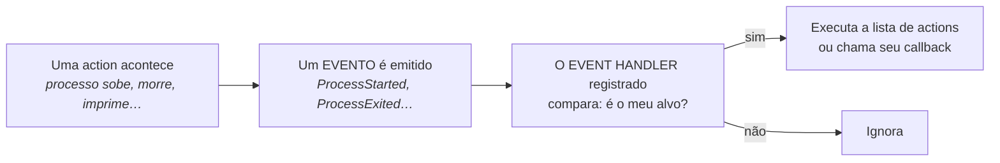

# Event handlers

*"Dado que X aconteceu, faça Y."*

---

O launch file não só lança nós: ele **observa** o que lançou e reage. Essa é a
função do `RegisterEventHandler`.

A ideia é simples de enunciar e muda a qualidade do seu sistema: em vez de
adivinhar com um `TimerAction` que "3 segundos devem bastar", você espera o
evento que realmente importa.

!!! info "Documentação"
    - **Tutorial oficial:** [Using event handlers](https://docs.ros.org/en/humble/Tutorials/Intermediate/Launch/Using-Event-Handlers.html)
    - **Código-fonte dos handlers:** [`launch/event_handlers/`](https://github.com/ros2/launch/tree/humble/launch/launch/event_handlers)
    - **Código-fonte dos eventos:** [`launch/events/`](https://github.com/ros2/launch/tree/humble/launch/launch/events)
    - **Handlers de lifecycle:** [`launch_ros/event_handlers/`](https://github.com/ros2/launch_ros/tree/humble/launch_ros/launch_ros/event_handlers)
    - **Arquitetura do launch** (o modelo de eventos por dentro): [architecture.rst](https://github.com/ros2/launch/blob/humble/launch/doc/source/architecture.rst)

    As páginas de API geradas automaticamente (`docs.ros.org/en/humble/p/launch/`)
    costumam vir vazias, porque as classes não têm docstring. O código-fonte é
    a documentação real — e cada arquivo tem menos de 100 linhas.

---

## O modelo mental



Três nomes que não se misturam:

| Nome | O que é |
|---|---|
| **Evento** | um fato que aconteceu (`ProcessExited`) — carrega dados, como o código de saída |
| **Event handler** | o vigia que espera um tipo de evento (`OnProcessExit`) |
| **`RegisterEventHandler`** | a *action* que instala o vigia na `LaunchDescription` |

Você nunca põe um `OnProcessExit` direto na lista — ele sempre vai dentro de um
`RegisterEventHandler`.

---

## O catálogo completo

### Handlers do `launch` (núcleo)

```python
from launch.event_handlers import (OnProcessStart, OnProcessIO, OnProcessExit,
                                   OnExecutionComplete, OnShutdown,
                                   OnIncludeLaunchDescription)
```

| Vigia → reação | Dispara quando… | Uso típico |
|---|---|---|
| `OnProcessStart`<br>→ `on_start` | o processo alvo **começa a rodar** | "assim que o simulador abrir, crie o robô" |
| `OnProcessIO`<br>→ `on_stdout`, `on_stderr`, `on_stdin` | o alvo **imprime** algo num dos 3 canais | esperar uma frase de "pronto" no log |
| `OnExecutionComplete`<br>→ `on_completion` | a **action** alvo conclui a execução | encadear o próximo passo após um comando |
| `OnProcessExit`<br>→ `on_exit` | o processo alvo **morre/fecha** | partida em sequência; derrubar tudo se o nó crítico cair |
| `OnShutdown`<br>→ `on_shutdown` | o launch **inteiro** está desligando (sem `target_action`) | limpeza e log final com o motivo |
| `OnIncludeLaunchDescription`<br>→ `on_include_launch_description` | um launch file é **incluído** | raro; instrumentação e depuração |
| `OnAction` | classe-base genérica | quando você precisa de um evento sem handler pronto |

!!! note "`OnProcessExit` vs `OnExecutionComplete`"
    Parecem iguais e não são. `OnProcessExit` fala de **processos do sistema
    operacional** (um `Node`, um `ExecuteProcess`) — e te entrega o
    `returncode`. `OnExecutionComplete` fala de **actions do launch**
    terminarem sua execução, o que inclui coisas que não são processo nenhum.
    Na prática, para nós e comandos, você quer `OnProcessExit`.

### Handler do `launch_ros` (lifecycle)

```python
from launch_ros.event_handlers import OnStateTransition
```

| Vigia | Dispara quando… |
|---|---|
| `OnStateTransition` | um **nó gerenciado** (lifecycle node) muda de estado |

Este é o único que sabe a diferença entre "o processo subiu" e "o nó está
**pronto**". Guarde esse nome — ele volta no
[capítulo de launch avançado](12-launch-avancado.md), quando falarmos do
`lifecycle_manager` do Nav2.

---

## Especificação dos parâmetros

O padrão é o mesmo em todos: um `target_action` (quem vigiar) e um ou mais
`on_*` (o que fazer). Todos aceitam também os parâmetros da classe-base.

### Parâmetros comuns (`EventHandler`)

```python
EventHandler(*, matcher, entities=None, handle_once=False)
```

| Parâmetro | Tipo | Para quê |
|---|---|---|
| `handle_once` | `bool` (padrão `False`) | se `True`, o handler dispara **uma vez** e se desregistra |

!!! danger "`handle_once` é o parâmetro que ninguém conhece"
    Por padrão, um handler dispara **toda vez** que o evento acontece. Se você
    registrar um `OnProcessIO` esperando a palavra "ready" no log, ele vai
    disparar a cada linha que contenha "ready" — para sempre. Quase todo caso
    de "esperei um evento" quer `handle_once=True`.

---

### `OnProcessStart`

```python
OnProcessStart(*, target_action=None, on_start, **kwargs)
```

| Parâmetro | Tipo | Descrição |
|---|---|---|
| `target_action` | `ExecuteProcess` \| `Callable[[ExecuteProcess], bool]` \| `None` | o objeto da action a vigiar. `None` = qualquer processo |
| `on_start` | lista de actions \| `Callable[[ProcessStarted, LaunchContext], Optional[list]]` | o que fazer |

**Evento recebido:** `ProcessStarted` — tem `.action`, `.pid`, `.process_name`,
`.cmd`, `.cwd`, `.env`.

---

### `OnProcessExit`

```python
OnProcessExit(*, target_action=None, on_exit, **kwargs)
```

| Parâmetro | Tipo | Descrição |
|---|---|---|
| `target_action` | `ExecuteProcess` \| callable \| `None` | quem vigiar |
| `on_exit` | lista de actions \| `Callable[[ProcessExited, LaunchContext], Optional[list]]` | o que fazer |

**Evento recebido:** `ProcessExited` — tem tudo do `ProcessStarted` **mais
`.returncode`**. É o handler mais útil do conjunto, porque `returncode == 0`
distingui "terminou o trabalho" de "morreu com erro".

---

### `OnProcessIO`

```python
OnProcessIO(*, target_action=None, on_stdin=None, on_stdout=None,
            on_stderr=None, **kwargs)
```

| Parâmetro | Tipo | Descrição |
|---|---|---|
| `on_stdout` / `on_stderr` / `on_stdin` | `Callable[[ProcessIO], Optional[list]]` | **só aceita callable** — não aceita lista de actions |

**Evento recebido:** `ProcessIO` — tem `.text` (**bytes**, não `str`),
`.from_stdout`, `.from_stderr`, `.from_stdin`, `.action`, `.pid`.

!!! warning "Duas pegadinhas do `OnProcessIO`"
    1. `event.text` vem em **bytes**. Use `event.text.decode()` antes de
       comparar com string.
    2. Só funciona se o processo alvo tiver `output='screen'` ou
       `output='both'`; sem isso o launch não captura a saída.

---

### `OnExecutionComplete`

```python
OnExecutionComplete(*, target_action=None, on_completion, **kwargs)
```

**Evento recebido:** `ExecutionComplete` — tem `.action`.

---

### `OnShutdown`

```python
OnShutdown(*, on_shutdown, **kwargs)
```

| Parâmetro | Tipo | Descrição |
|---|---|---|
| `on_shutdown` | lista de actions \| `Callable[[Shutdown, LaunchContext], Optional[list]]` | o que fazer ao desligar |

**Não tem `target_action`** — vigia o launch inteiro.
**Evento recebido:** `Shutdown` — tem `.reason` e `.due_to_sigint`.

---

### `OnStateTransition` (launch_ros)

```python
OnStateTransition(*, target_lifecycle_node=None, transition=None,
                  start_state=None, goal_state=None, entities=None, **kwargs)
```

| Parâmetro | Descrição |
|---|---|
| `target_lifecycle_node` | o objeto `LifecycleNode` a vigiar |
| `goal_state` | dispara ao **chegar** neste estado (`'inactive'`, `'active'`, …) |
| `start_state` | dispara ao **sair** deste estado |
| `transition` | o nome da transição (`'configure'`, `'activate'`, …) |
| `entities` | as actions a executar |

---

## Os dois formatos de callback

Todo `on_*` (menos os do `OnProcessIO`) aceita **duas** formas:

**Declarativa** — uma lista de actions:

```python
on_exit=[LogInfo(msg='Acabou'), outro_node]
```

**Programática** — um callable que recebe o evento e o contexto:

```python
def ao_sair(event, context):
    if event.returncode != 0:
        return [LogInfo(msg=f'FALHOU com código {event.returncode}')]
    return [LogInfo(msg='Terminou limpo')]

on_exit=ao_sair
```

A forma programática é a única que dá acesso aos **dados do evento**. Use-a
sempre que a reação depender do *como* aconteceu, não só do *que* aconteceu.

!!! tip "Quando não souber o que o evento tem dentro"
    ```python
    def espiar(event, context):
        print(type(event), [a for a in dir(event) if not a.startswith('_')])
        return None
    ```
    Vale mais que qualquer tabela, e funciona em qualquer versão.

---

## Emitindo eventos você mesmo

`EmitEvent` dispara um evento no sistema de launch. Os dois que importam:

```python
from launch.actions import EmitEvent
from launch.events import Shutdown
from launch.events.process import SignalProcess
from launch.events import matches_action

# derrubar TODO o sistema
EmitEvent(event=Shutdown(reason='driver do robô morreu'))

# mandar SIGINT só para um processo
EmitEvent(event=SignalProcess(signal_number='SIGINT',
                              process_matcher=matches_action(meu_node)))
```

E `LocalSubstitution` lê campos do evento **dentro** de uma substituição:

```python
LogInfo(msg=['Desligando porque: ', LocalSubstitution('event.reason')])
```

---

## Três exemplos de propósito geral

### 🟢 Nível 1 — Sequência garantida

O caso clássico: só crie a segunda tartaruga **depois** que o simulador
estiver de pé.

```python
from launch import LaunchDescription
from launch.actions import ExecuteProcess, LogInfo, RegisterEventHandler
from launch.event_handlers import OnProcessStart
from launch_ros.actions import Node


def generate_launch_description():
    turtlesim_node = Node(
        package='turtlesim',
        executable='turtlesim_node',
        name='sim',
        output='screen',
    )

    spawn_turtle = ExecuteProcess(
        cmd=['ros2 service call /spawn turtlesim/srv/Spawn "{x: 2, y: 2}"'],
        shell=True,
        output='screen',
    )

    return LaunchDescription([
        turtlesim_node,
        RegisterEventHandler(
            OnProcessStart(
                target_action=turtlesim_node,
                on_start=[
                    LogInfo(msg='Simulador no ar, criando turtle2'),
                    spawn_turtle,
                ]
            )
        ),
    ])
```

!!! danger "`target_action` recebe o OBJETO, não o nome"
    Por isso o `turtlesim_node` foi guardado numa variável **antes** de entrar
    na lista. Passar a string `'sim'` não funciona — e o erro não é óbvio.

---

### 🟡 Nível 2 — Reagir ao *como* terminou

Aqui entra a forma programática: distinguir "terminou o trabalho" de "morreu".

```python
from launch import LaunchDescription
from launch.actions import (EmitEvent, ExecuteProcess, LogInfo,
                            RegisterEventHandler)
from launch.event_handlers import OnProcessExit, OnShutdown
from launch.events import Shutdown
from launch.substitutions import LocalSubstitution


def generate_launch_description():
    tarefa = ExecuteProcess(
        cmd=['bash', '-c', 'sleep 2 && exit 3'],   # simula uma falha
        output='screen',
    )

    def ao_sair(event, context):
        if event.returncode == 0:
            return [LogInfo(msg='Etapa concluída, seguindo em frente.')]
        return [
            LogInfo(msg=f'FALHOU (código {event.returncode}). Abortando.'),
            EmitEvent(event=Shutdown(reason=f'tarefa falhou: {event.returncode}')),
        ]

    return LaunchDescription([
        tarefa,
        RegisterEventHandler(
            OnProcessExit(target_action=tarefa, on_exit=ao_sair)),
        RegisterEventHandler(
            OnShutdown(on_shutdown=[
                LogInfo(msg=['Desligando porque: ',
                             LocalSubstitution('event.reason')])])),
    ])
```

Três coisas para notar: `event.returncode` só existe na forma programática;
`OnShutdown` não tem `target_action`; e `LocalSubstitution('event.reason')` é
como se lê o motivo dentro de uma substituição.

---

### 🟠 Nível 3 — Esperar o processo dizer que está pronto

`OnProcessStart` diz que o processo **existe**, não que ele está **pronto**.
Quando o alvo anuncia prontidão no log, `OnProcessIO` é mais preciso:

```python
from launch import LaunchDescription
from launch.actions import ExecuteProcess, LogInfo, RegisterEventHandler
from launch.event_handlers import OnProcessIO


def generate_launch_description():
    servidor = ExecuteProcess(
        cmd=['bash', '-c', 'sleep 3 && echo "SERVIDOR PRONTO" && sleep 300'],
        output='screen',
    )

    cliente = ExecuteProcess(cmd=['echo', 'cliente disparado'], output='screen')

    def quando_pronto(event):
        texto = event.text.decode().strip()      # bytes -> str
        if 'SERVIDOR PRONTO' in texto:
            return [LogInfo(msg='Detectado! Subindo o cliente.'), cliente]
        return None

    return LaunchDescription([
        servidor,
        RegisterEventHandler(
            OnProcessIO(
                target_action=servidor,
                on_stdout=quando_pronto,
                handle_once=True,               # senão dispara a cada linha
            )
        ),
    ])
```

!!! warning "Frágil por natureza"
    Você está acoplando seu launch a uma **string de log** de outro programa.
    Uma atualização muda o texto e o seu sistema quebra em silêncio. Use quando
    não houver alternativa — e prefira, sempre que possível, o
    `OnStateTransition` do último exemplo.

---

## Evento vence relógio

Um encadeamento por `TimerAction` quebra silenciosamente quando a máquina está
mais lenta, ou quando um passo demora mais que o previsto. O mesmo
encadeamento por `OnProcessExit` continua correto.

| Situação | Ferramenta |
|---|---|
| "espere o processo A subir" | `OnProcessStart` |
| "espere o comando A terminar" | `OnProcessExit` |
| "espere o nó ficar `active`" | `OnStateTransition` |
| "dê 2 s para a placa estabilizar depois de energizar" | `TimerAction` ✅ |

`TimerAction` é legítimo para **acomodação física** — hardware que precisa de
um tempo morto. É ilegítimo como **sincronização** de software.

---

## Três exemplos para o Go2 e o Nav2

### 🟢 Nível 1 — Bringup em ordem

O Nav2 não pode subir antes de existir odometria e TF. No Go2, isso significa
esperar a ponte com o `unitree_sdk2` estar rodando.

```python
import os

from ament_index_python.packages import get_package_share_directory
from launch import LaunchDescription
from launch.actions import (IncludeLaunchDescription, LogInfo,
                            RegisterEventHandler)
from launch.event_handlers import OnProcessStart
from launch.launch_description_sources import PythonLaunchDescriptionSource
from launch_ros.actions import Node


def generate_launch_description():
    go2_driver = Node(
        package='go2_driver',
        executable='go2_driver_node',
        name='go2_driver',
        output='screen',
    )

    livox = Node(
        package='livox_ros_driver2',
        executable='livox_ros_driver2_node',
        name='livox_lidar',
        output='screen',
    )

    nav2 = IncludeLaunchDescription(
        PythonLaunchDescriptionSource(os.path.join(
            get_package_share_directory('nav2_bringup'),
            'launch', 'navigation_launch.py')))

    return LaunchDescription([
        go2_driver,
        # o lidar só depois do driver do robô
        RegisterEventHandler(
            OnProcessStart(target_action=go2_driver,
                           on_start=[LogInfo(msg='Driver do Go2 no ar'), livox])),
        # o Nav2 só depois do lidar
        RegisterEventHandler(
            OnProcessStart(target_action=livox,
                           on_start=[LogInfo(msg='Livox no ar, subindo Nav2'), nav2])),
    ])
```

!!! warning "Isto ainda não é suficiente — e é importante entender por quê"
    `OnProcessStart` garante que o **processo** subiu. Não garante que o driver
    já está publicando `/odom`, nem que a TF `odom → base_link` existe. Para
    hardware real, "o processo existe" é uma aproximação grosseira de "o
    sistema está pronto".

    É exatamente por isso que o Nav2 **não** usa event handlers para ordenar o
    bringup: ele usa o `lifecycle_manager`, que espera cada nó reportar
    `active`. Veja o [capítulo de launch avançado](12-launch-avancado.md).

---

### 🟡 Nível 2 — Watchdog do robô

Um Nav2 rodando sem ninguém do outro lado do `/cmd_vel` é pior que um Nav2
desligado: ele acha que está comandando o robô. Se a ponte morrer, derrube
tudo — e diga por quê.

```python
from launch.actions import EmitEvent, LogInfo, RegisterEventHandler
from launch.event_handlers import OnProcessExit, OnShutdown
from launch.events import Shutdown
from launch.substitutions import LocalSubstitution


def driver_morreu(event, context):
    if event.returncode == 0:
        motivo = 'driver do Go2 encerrou normalmente'
    else:
        motivo = f'driver do Go2 caiu (código {event.returncode})'
    return [
        LogInfo(msg=f'!!! {motivo} — derrubando a navegação'),
        EmitEvent(event=Shutdown(reason=motivo)),
    ]


# ... dentro da LaunchDescription:
RegisterEventHandler(
    OnProcessExit(target_action=go2_driver, on_exit=driver_morreu)),

RegisterEventHandler(
    OnShutdown(on_shutdown=[
        LogInfo(msg=['Sistema encerrado: ', LocalSubstitution('event.reason')])])),
```

!!! tip "O padrão do 'nó crítico'"
    Escolha 1 ou 2 processos sem os quais o sistema não faz sentido — no Go2,
    a ponte com o robô — e ligue um `OnProcessExit → Shutdown` neles. É a
    diferença entre um robô que para e um robô que continua se achando
    controlado.

    Cuidado com o inverso: **não** ponha isso em nós auxiliares (RViz,
    ferramentas de debug), ou fechar uma janela vai derrubar o robô.

---

### 🔴 Nível 3 — Esperar o nó ficar `active`

Este é o formato que o Nav2 usa por dentro, e a resposta ao aviso do exemplo
🟢: o `OnStateTransition` espera o nó **reportar prontidão**, não apenas
existir.

```python
from launch import LaunchDescription
from launch.actions import EmitEvent, LogInfo, RegisterEventHandler
from launch_ros.actions import LifecycleNode
from launch_ros.event_handlers import OnStateTransition
from launch_ros.events.lifecycle import ChangeState
from lifecycle_msgs.msg import Transition
import launch


def generate_launch_description():
    map_server = LifecycleNode(
        package='nav2_map_server',
        executable='map_server',
        name='map_server',
        namespace='',
        output='screen',
        parameters=[{'yaml_filename': '/caminho/mapa.yaml'}],
    )

    amcl = LifecycleNode(
        package='nav2_amcl', executable='amcl',
        name='amcl', namespace='', output='screen',
    )

    return LaunchDescription([
        map_server,

        # 1) manda configurar o map_server
        EmitEvent(event=ChangeState(
            lifecycle_node_matcher=launch.events.matches_action(map_server),
            transition_id=Transition.TRANSITION_CONFIGURE)),

        # 2) quando ele chegar em 'inactive', ative
        RegisterEventHandler(
            OnStateTransition(
                target_lifecycle_node=map_server,
                goal_state='inactive',
                entities=[
                    LogInfo(msg='map_server configurado, ativando'),
                    EmitEvent(event=ChangeState(
                        lifecycle_node_matcher=launch.events.matches_action(map_server),
                        transition_id=Transition.TRANSITION_ACTIVATE)),
                ])),

        # 3) só quando estiver ACTIVE de verdade, suba o AMCL
        RegisterEventHandler(
            OnStateTransition(
                target_lifecycle_node=map_server,
                goal_state='active',
                entities=[
                    LogInfo(msg='map_server ATIVO — mapa disponível'),
                    amcl,
                ])),
    ])
```

Compare com o exemplo 🟢: lá o gatilho era "o processo existe"; aqui é "o nó
carregou o mapa, publicou e está servindo". São garantias de qualidade
completamente diferentes.

!!! note "Você não vai escrever isso no dia a dia"
    Na prática o `lifecycle_manager` do Nav2 faz tudo isso por você, a partir
    de uma lista ordenada de nomes de nós. Este exemplo existe para você
    **entender o que ele faz por dentro** — e para os casos em que precisar
    orquestrar um nó gerenciado seu junto ao Nav2.

---

## Limites que valem conhecer

!!! danger "Não dá para vigiar uma action dentro de um launch incluído"
    `target_action` precisa do **objeto** Python. Quando você usa
    `IncludeLaunchDescription`, os nós do filho são criados lá dentro e você
    não tem referência a eles. Não existe
    `target_action='controller_server'`.

    Saídas: mover o nó para o pai, usar `OnProcessIO` (frágil), ou —
    o caminho certo — usar `OnStateTransition` / `lifecycle_manager`.

!!! danger "`OnShutdown` roda enquanto tudo está morrendo"
    Tentar chamar um serviço ROS no `on_shutdown` (por exemplo, salvar o mapa
    com o `map_saver`) costuma falhar: o nó que atenderia já está encerrando.
    Para salvar estado, dispare a ação **antes** de desligar, com um
    `OnProcessExit` no processo certo — ou faça pelo terminal mesmo.

!!! warning "Sem `handle_once`, o handler dispara sempre"
    Vale relembrar: `OnProcessIO` sem `handle_once=True` vai reagir a cada
    linha que casar, indefinidamente.

---

## Resumo de bolso

```python
from launch.actions import RegisterEventHandler, EmitEvent, LogInfo
from launch.event_handlers import (OnProcessStart, OnProcessExit,
                                   OnProcessIO, OnExecutionComplete, OnShutdown)
from launch.events import Shutdown, matches_action
from launch.substitutions import LocalSubstitution
from launch_ros.event_handlers import OnStateTransition   # lifecycle
```

| Quero… | Uso |
|---|---|
| encadear "só depois que subir" | `OnProcessStart` |
| encadear "só depois que terminar" | `OnProcessExit` |
| saber **como** terminou | `OnProcessExit` + callback com `event.returncode` |
| esperar uma frase no log | `OnProcessIO` + `handle_once=True` |
| derrubar tudo | `EmitEvent(event=Shutdown(reason=...))` |
| log final com o motivo | `OnShutdown` + `LocalSubstitution('event.reason')` |
| esperar um nó ficar **pronto** | `OnStateTransition` |

Os exercícios estão em [Exercícios de launch](10-launch-exercicios.md) —
especialmente o **4**, que é exatamente o teste de "evento vence relógio".
