# tf2

*Quem está onde, em relação a quem.*

---

## Transformações estáticas

Publicar transformações estáticas serve para descrever a relação **fixa** entre
a base do robô e as partes que não se movem — sensores, principalmente.

```bash
ros2 pkg create --build-type ament_python learning_tf2_py
cd src/learning_tf2_py/learning_tf2_py
wget https://raw.githubusercontent.com/ros/geometry_tutorials/ros2/turtle_tf2_py/turtle_tf2_py/static_turtle_tf2_broadcaster.py
```

```python
class StaticFramePublisher(Node):

    def __init__(self, transformation):
        super().__init__('static_turtle_tf2_broadcaster')
        self.tf_static_broadcaster = StaticTransformBroadcaster(self)
        # publica uma vez, na inicialização
        self.make_transforms(transformation)
```

O argumento `transformation` é simplesmente o que veio da linha de comando.

### Preenchendo o formulário

```python
def make_transforms(self, transformation):
    t = TransformStamped()

    t.header.stamp = self.get_clock().now().to_msg()
    t.header.frame_id = 'world'                 # frame PAI
    t.child_frame_id = transformation[1]        # frame FILHO

    t.transform.translation.x = float(transformation[2])
    t.transform.translation.y = float(transformation[3])
    t.transform.translation.z = float(transformation[4])

    quat = quaternion_from_euler(
        float(transformation[5]), float(transformation[6]), float(transformation[7]))
    t.transform.rotation.x = quat[0]
    t.transform.rotation.y = quat[1]
    t.transform.rotation.z = quat[2]
    t.transform.rotation.w = quat[3]

    self.tf_static_broadcaster.sendTransform(t)
```

A ordem nunca muda, e vale decorar como sequência:

1. **quando** — `header.stamp`;
2. **em relação a quem** — `header.frame_id`, o pai;
3. **quem** — `child_frame_id`, o filho;
4. **onde** — a translação;
5. **como está virado** — a rotação, em quaternion;
6. **envia**.

Os ângulos entram como Euler (roll, pitch, yaw) e são convertidos para
quaternion antes de ir para a mensagem.

### O `main`

```python
def main():
    logger = rclpy.logging.get_logger('logger')

    if len(sys.argv) != 8:
        logger.info('Invalid number of parameters. Usage: \n'
                    '$ ros2 run learning_tf2_py static_turtle_tf2_broadcaster'
                    'child_frame_name x y z roll pitch yaw')
        sys.exit(1)

    if sys.argv[1] == 'world':
        logger.info('Your static turtle name cannot be "world"')
        sys.exit(2)

    rclpy.init()
    node = StaticFramePublisher(sys.argv)
    try:
        rclpy.spin(node)
    except KeyboardInterrupt:
        pass
    rclpy.shutdown()
```

### Dependências e build

```xml
<exec_depend>geometry_msgs</exec_depend>
<exec_depend>python3-numpy</exec_depend>
<exec_depend>rclpy</exec_depend>
<exec_depend>tf2_ros_py</exec_depend>
<exec_depend>turtlesim</exec_depend>
```

```python
'static_turtle_tf2_broadcaster = learning_tf2_py.static_turtle_tf2_broadcaster:main',
```

```bash
rosdep install -i --from-path src --rosdistro foxy -y
colcon build --packages-select learning_tf2_py
. install/setup.bash
ros2 run learning_tf2_py static_turtle_tf2_broadcaster mystaticturtle 0 0 1 0 0 0
```

### Conferindo

```bash
ros2 topic echo --qos-reliability reliable --qos-durability transient_local /tf_static
```

```yaml
transforms:
- header:
    stamp:
      sec: 1622908754
      nanosec: 208515730
    frame_id: world
  child_frame_id: mystaticturtle
  transform:
    translation: {x: 0.0, y: 0.0, z: 1.0}
    rotation: {x: 0.0, y: 0.0, z: 0.0, w: 1.0}
```

!!! warning "Sem os flags de QoS você não vê nada"
    O `/tf_static` publica uma vez só, com *latch* (`transient_local`). Um
    `ros2 topic echo` comum fica em silêncio para sempre e parece que o
    broadcaster falhou.

### O jeito certo, sem escrever código

O ROS já traz uma ferramenta pronta, que serve como comando **e** como nó de
launch file:

```bash
ros2 run tf2_ros static_transform_publisher x y z yaw pitch roll frame_id child_frame_id
ros2 run tf2_ros static_transform_publisher x y z qx qy qz qw frame_id child_frame_id
```

!!! warning "A ordem dos ângulos é uma armadilha"
    Na linha de comando é **yaw pitch roll**. No código, `quaternion_from_euler`
    recebe **roll pitch yaw**. Trocar dá um robô deitado sem erro nenhum no log.

    Em Humble e distros posteriores esta forma posicional ficou deprecada em
    favor de flags nomeadas: `--x`, `--y`, `--z`, `--yaw`, `--pitch`, `--roll`,
    `--frame-id`, `--child-frame-id`.

```python
Node(
    package='tf2_ros',
    executable='static_transform_publisher',
    arguments=['0', '0', '1', '0', '0', '0', 'world', 'mystaticturtle']
),
```

---

## Broadcaster dinâmico

Agora a transformação muda ao longo do tempo: ela acompanha a tartaruga.

```python
class FramePublisher(Node):

    def __init__(self):
        super().__init__('turtle_tf2_frame_publisher')

        self.turtlename = self.declare_parameter(
            'turtlename', 'turtle').get_parameter_value().string_value

        self.tf_broadcaster = TransformBroadcaster(self)

        self.subscription = self.create_subscription(
            Pose,
            f'/{self.turtlename}/pose',
            self.handle_turtle_pose,
            1)
        self.subscription

    def handle_turtle_pose(self, msg):
        t = TransformStamped()

        t.header.stamp = self.get_clock().now().to_msg()
        t.header.frame_id = 'world'
        t.child_frame_id = self.turtlename

        t.transform.translation.x = msg.x
        t.transform.translation.y = msg.y
        t.transform.translation.z = 0.0

        q = quaternion_from_euler(0, 0, msg.theta)
        t.transform.rotation.x = q[0]
        t.transform.rotation.y = q[1]
        t.transform.rotation.z = q[2]
        t.transform.rotation.w = q[3]

        self.tf_broadcaster.sendTransform(t)
```

A diferença estrutural para o estático são duas linhas: `TransformBroadcaster`
no lugar de `StaticTransformBroadcaster`, e o envio dentro de um **callback de
subscription** em vez de uma vez no construtor.

O nome do tópico é montado com o parâmetro (`f'/{self.turtlename}/pose'`), e é
isso que permite subir dois broadcasters do mesmo executável — um para cada
tartaruga — só mudando o parâmetro.

Como a tartaruga só anda no plano, `translation.z` é zero e a única rotação é
em torno de Z (o `theta` da pose).

### Launch file

```python
def generate_launch_description():
    return LaunchDescription([
        Node(
            package='turtlesim',
            executable='turtlesim_node',
            name='sim'
        ),
        Node(
            package='learning_tf2_py',
            executable='turtle_tf2_broadcaster',
            name='broadcaster1',
            parameters=[{'turtlename': 'turtle1'}]
        ),
    ])
```

```bash
ros2 launch learning_tf2_py turtle_tf2_demo.launch.py
ros2 run turtlesim turtle_teleop_key
ros2 run tf2_ros tf2_echo world turtle1
```

```
At time 1625137663.912474878
- Translation: [5.276, 7.930, 0.000]
- Rotation: in Quaternion [0.000, 0.000, 0.934, -0.357]
```

---

## Listener

O listener ouve a árvore de transformações, calcula a diferença entre dois
frames e usa isso para mover uma tartaruga atrás da outra.

```bash
wget https://raw.githubusercontent.com/ros/geometry_tutorials/ros2/turtle_tf2_py/turtle_tf2_py/turtle_tf2_listener.py
```

```python
class FrameListener(Node):

    def __init__(self):
        super().__init__('turtle_tf2_frame_listener')

        self.target_frame = self.declare_parameter(
            'target_frame', 'turtle1').get_parameter_value().string_value

        self.tf_buffer = Buffer()
        self.tf_listener = TransformListener(self.tf_buffer, self)

        self.spawner = self.create_client(Spawn, 'spawn')
        self.turtle_spawning_service_ready = False
        self.turtle_spawned = False

        self.publisher = self.create_publisher(Twist, 'turtle2/cmd_vel', 1)
        self.timer = self.create_timer(1.0, self.on_timer)
```

Cinco coisas no construtor: o parâmetro do frame alvo, o **Buffer** (que guarda
as transformações dos últimos ~10 s), o **TransformListener** (que se inscreve
em `/tf` e `/tf_static`), o cliente do serviço `spawn`, e o publisher de
velocidade mais o timer de 1 s.

### O `on_timer` é uma máquina de estados

Os estados são as combinações das duas flags `(ready, spawned)`, e **cada
transição consome um tick do timer**:

```mermaid
stateDiagram-v2
    [*] --> q0
    q0: q0 — espera o serviço<br/>(F, F)
    q1: q1 — espera o Future<br/>(T, F)
    q2: q2 — perseguição<br/>(T, T)

    q0 --> q0: [não pronto] / loga "not ready"
    q0 --> q1: [service_is_ready()] / call_async; ready = True
    q1 --> q1: [!done()] / loga "not finished"
    q1 --> q2: [result.done()] / loga sucesso; spawned = True
    q2 --> q2: [todo tick] / lookup → publica Twist
```



O par `(F, T)` é inatingível. O `q2` é absorvente: uma vez lá, o nó nunca mais
sai.

```python
def on_timer(self):
    if self.turtle_spawning_service_ready:
        if self.turtle_spawned:
            # ---- estado q2: perseguição ----
            from_frame_rel = self.target_frame
            to_frame_rel = 'turtle2'

            try:
                t = self.tf_buffer.lookup_transform(
                    to_frame_rel,
                    from_frame_rel,
                    rclpy.time.Time())
            except TransformException as ex:
                self.get_logger().info(
                    f'Could not transform {to_frame_rel} to {from_frame_rel}: {ex}')
                return

            msg = Twist()
            scale_rotation_rate = 1.0
            msg.angular.z = scale_rotation_rate * math.atan2(
                t.transform.translation.y,
                t.transform.translation.x)

            scale_forward_speed = 0.5
            msg.linear.x = scale_forward_speed * math.sqrt(
                t.transform.translation.x ** 2 +
                t.transform.translation.y ** 2)

            self.publisher.publish(msg)
        else:
            # ---- estado q1: esperando o Future do spawn ----
            if self.result.done():
                self.get_logger().info(
                    f'Successfully spawned {self.result.result().name}')
                self.turtle_spawned = True
            else:
                self.get_logger().info('Spawn is not finished')
    else:
        # ---- estado q0: esperando o serviço aparecer ----
        if self.spawner.service_is_ready():
            request = Spawn.Request()
            request.name = 'turtle2'
            request.x = float(4)
            request.y = float(2)
            request.theta = float(0)
            self.result = self.spawner.call_async(request)
            self.turtle_spawning_service_ready = True
        else:
            self.get_logger().info('Service is not ready')
```

### A fórmula de controle

O bloco da perseguição é um controlador proporcional:

$$\text{comando} = \text{ganho} \times \text{erro}$$

O erro de **distância** é a norma euclidiana entre os frames:

$$d(p, q) = \sqrt{\sum_{i=1}^{n} (q_i - p_i)^2}$$

E o erro **angular** é o ângulo até o alvo, que no código vira o `atan2` — a
forma numericamente estável de calcular

$$\cos \theta = \frac{u_x v_x + u_y v_y}{\sqrt{u_x^2 + u_y^2}\sqrt{v_x^2 + v_y^2}}$$

`rclpy.time.Time()` vazio no `lookup_transform` significa "a transformação mais
recente disponível".

### Launch file completo

```python
def generate_launch_description():
    return LaunchDescription([
        Node(package='turtlesim', executable='turtlesim_node', name='sim'),
        Node(
            package='learning_tf2_py',
            executable='turtle_tf2_broadcaster',
            name='broadcaster1',
            parameters=[{'turtlename': 'turtle1'}]
        ),
        DeclareLaunchArgument(
            'target_frame', default_value='turtle1',
            description='Target frame name.'
        ),
        Node(
            package='learning_tf2_py',
            executable='turtle_tf2_broadcaster',
            name='broadcaster2',
            parameters=[{'turtlename': 'turtle2'}]
        ),
        Node(
            package='learning_tf2_py',
            executable='turtle_tf2_listener',
            name='listener',
            parameters=[{'target_frame': LaunchConfiguration('target_frame')}]
        ),
    ])
```

---

## Adicionando um frame

Em vez de perseguir a outra tartaruga, vamos perseguir um ponto **deslocado**
em relação a ela: o frame `carrot1`, filho de `turtle1`.

```bash
wget https://raw.githubusercontent.com/ros/geometry_tutorials/ros2/turtle_tf2_py/turtle_tf2_py/fixed_frame_tf2_broadcaster.py
```

```python
class FixedFrameBroadcaster(Node):

    def __init__(self):
        super().__init__('fixed_frame_tf2_broadcaster')
        self.tf_broadcaster = TransformBroadcaster(self)
        self.timer = self.create_timer(0.1, self.broadcast_timer_callback)

    def broadcast_timer_callback(self):
        t = TransformStamped()

        t.header.stamp = self.get_clock().now().to_msg()
        t.header.frame_id = 'turtle1'      # o pai agora é a tartaruga
        t.child_frame_id = 'carrot1'

        t.transform.translation.x = 0.0
        t.transform.translation.y = 2.0    # 2 metros à esquerda dela
        t.transform.translation.z = 0.0
        t.transform.rotation.x = 0.0
        t.transform.rotation.y = 0.0
        t.transform.rotation.z = 0.0
        t.transform.rotation.w = 1.0

        self.tf_broadcaster.sendTransform(t)
```

A única mudança conceitual: o `frame_id` não é mais `world`, é `turtle1`. A
árvore ficou com três níveis.

### Reaproveitando o launch anterior

```python
def generate_launch_description():
    demo_nodes = IncludeLaunchDescription(
        PythonLaunchDescriptionSource([os.path.join(
            get_package_share_directory('learning_tf2_py'), 'launch'),
            '/turtle_tf2_demo.launch.py']),
    )

    return LaunchDescription([
        demo_nodes,
        Node(
            package='learning_tf2_py',
            executable='fixed_frame_tf2_broadcaster',
            name='fixed_broadcaster',
        ),
    ])
```

```bash
ros2 launch learning_tf2_py turtle_tf2_fixed_frame_demo.launch.py
ros2 launch learning_tf2_py turtle_tf2_fixed_frame_demo.launch.py target_frame:=carrot1
```

### Frame dinâmico

Basta trocar o deslocamento fixo por uma função do tempo:

```python
seconds, _ = self.get_clock().now().seconds_nanoseconds()
x = seconds * math.pi

t.transform.translation.x = 10 * math.sin(x)
t.transform.translation.y = 10 * math.cos(x)
```

Agora a cenoura gira em torno da tartaruga, e a `turtle2` persegue um alvo em
movimento.

---

## Exercícios

### Exercício 1 — Árvore na mão 🟢

**Objetivo:** ler a árvore antes de escrevê-la.

**Especificação:** com a demo rodando, use `ros2 run tf2_ros tf2_echo` para
descobrir a transformação de `world` para `turtle2`, e depois de `turtle1` para
`turtle2`. Desenhe a árvore no papel.

**✅ Aprovado se:** você sabe dizer quem é pai de quem e por que a segunda
consulta funciona mesmo sem ninguém ter publicado essa transformação
diretamente.

### Exercício 2 — Sensor no robô 🟢

**Objetivo:** transformação estática pela CLI.

**Especificação:** publique um frame `laser` 20 cm acima e 10 cm à frente de
`turtle1`, girado 180° em yaw — sem escrever código. Confira com `tf2_echo`.

**✅ Aprovado se:** o `tf2_echo world laser` acompanha a tartaruga e o
quaternion reflete o giro.

??? tip "Dica"
    O `static_transform_publisher` aceita um frame pai que se move: a
    composição é feita pelo tf2, não por você.

### Exercício 3 — Perseguição invertida 🟡

**Objetivo:** entender que a ordem dos frames no `lookup_transform` importa.

**Especificação:** inverta os argumentos do `lookup_transform` no listener e
explique, com o robô rodando, o que exatamente acontece.

**✅ Aprovado se:** você consegue descrever o comportamento **antes** de rodar,
e o robô confirma.

### Exercício 4 — Escolta lateral 🟡

**Objetivo:** frame fixo com propósito.

**Especificação:** faça a `turtle2` andar sempre 1,5 m **atrás** da `turtle1`,
não ao lado. Depois faça o offset ser configurável por parâmetro.

**✅ Aprovado se:** a `turtle2` segue atrás em curvas, e
`ros2 param set` muda a distância em tempo real.

### Exercício 5 — Frame que não existe 🟠

**Objetivo:** ler exceção de tf2.

**Especificação:** peça uma transformação para um frame inexistente e depois
para um frame que só vai existir daqui a 2 segundos. Compare as duas mensagens
de erro.

**✅ Aprovado se:** você sabe a diferença entre "frame não existe" e "frame
existe mas não nesse instante de tempo" — e sabe por que o Buffer tem 10 s.

### Exercício 6 — Visualizando no RViz 🔴

**Objetivo:** fechar o ciclo.

**Especificação:** adicione o `rviz2` ao launch com um arquivo de configuração
que já mostra o display de TF, com `world` como fixed frame.

**✅ Aprovado se:** um único comando sobe simulador, broadcasters, listener e
RViz, e os frames aparecem se movendo.
