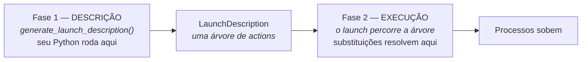
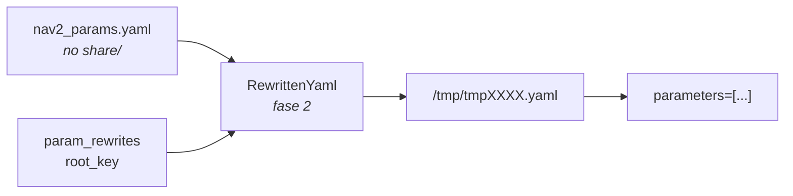

# Launch avançado

*O mínimo para ler um launch file do Nav2 sem travar — e escrever o seu.*

---

!!! abstract "O corte deste capítulo"
    O sistema de launch do ROS 2 é grande. Este capítulo cobre **só** o que
    aparece no `nav2_bringup` e no que você vai escrever para o Go2. O que
    ficou de fora, e por quê, está em
    [O que deixar para depois](#o-que-deixar-para-depois) — leia essa seção,
    ela é parte do plano.

---

## O problema comum

Um launch file roda em **duas fases**, e quase todo bug de launch vem de
confundir uma com a outra.



!!! danger "`LaunchConfiguration` NÃO é uma string"
    Na fase 1, `LaunchConfiguration('use_slam')` é um **objeto** que significa
    "o valor de `use_slam`, quando alguém resolver isso". Não é `'true'`.

    ```python
    if LaunchConfiguration('use_slam') == 'true':   # SEMPRE False
        ...
    os.path.join(share_dir, LaunchConfiguration('robot'))   # TypeError
    ```

Tudo neste capítulo existe para lidar com isso.

---

## Parte 1 — Condições

A ferramenta mais barata, e a que você deve tentar **antes** de qualquer outra.

```python
from launch.conditions import IfCondition, UnlessCondition
from launch.substitutions import LaunchConfiguration, PythonExpression
```

`condition=` funciona em **qualquer** action — `Node`, `GroupAction`,
`IncludeLaunchDescription`, `ExecuteProcess`:

```python
Node(package='rviz2', executable='rviz2',
     condition=IfCondition(LaunchConfiguration('use_rviz')))

Node(package='nav2_amcl', executable='amcl',
     condition=UnlessCondition(LaunchConfiguration('use_slam')))
```

Para lógica composta, `PythonExpression` monta uma expressão Python avaliada na
fase 2:

```python
condition=IfCondition(PythonExpression([
    'not ', LaunchConfiguration('use_composition')
]))
```

!!! tip "É assim que o Nav2 alterna entre nós normais e componíveis"
    O `navigation_launch.py` lista os mesmos nós **duas vezes** — uma como
    `Node` com `IfCondition(PythonExpression(['not ', use_composition]))`, outra
    como `ComposableNode` com `IfCondition(use_composition)`. Reconhecer esse
    par evita a impressão de que o arquivo está duplicado por engano.

Cuidado com o espaço em `'not '`: substituições são concatenadas **sem
separador**, e `notFalse` não é Python válido.

Bônus do Humble: `NotSubstitution`, `AndSubstitution` e `OrSubstitution`, mais
legíveis que montar `PythonExpression` na mão.

---

## Parte 2 — OpaqueFunction

### O que é

Uma **action** que, quando executada (fase 2), chama uma função Python sua e
passa o `LaunchContext`. O que a função devolver — uma lista de actions — é
executado ali mesmo. É a única porta para entrar na fase 2 com Python normal.

```python
from launch.actions import DeclareLaunchArgument, OpaqueFunction


def launch_setup(context, *args, **kwargs):
    robot = LaunchConfiguration('robot').perform(context)
    print(f'>>> {robot} (tipo: {type(robot)})')
    return []


def generate_launch_description():
    return LaunchDescription([
        DeclareLaunchArgument('robot', default_value='go2'),
        OpaqueFunction(function=launch_setup),
    ])
```

Duas coisas para gravar: a assinatura é sempre
`def f(context, *args, **kwargs)`, e **`.perform(context)` devolve sempre
`str`** — mesmo para `1000` ou `true`.

### As três armadilhas

!!! danger "1. `DeclareLaunchArgument` fica FORA"
    O `--show-args` passeia pela descrição procurando declarações e **não
    executa** a OpaqueFunction. Argumentos declarados lá dentro ficam
    invisíveis.

!!! danger "2. O que sai de lá não existe do lado de fora"
    As actions nascem na fase 2 — não dá para usá-las como `target_action` de
    um `RegisterEventHandler` declarado fora.

!!! danger "3. Nada de `sys.exit()`"
    Levante `RuntimeError(...)`; o launch reporta direito.

### Quando NÃO usar

| Situação | Use |
|---|---|
| ligar/desligar uma action | `IfCondition` / `UnlessCondition` |
| comparar, `and`/`or`/`==` | `IfCondition(PythonExpression([...]))` |
| montar caminho | `PathJoinSubstitution` |
| **ler o valor como string, laços, ler arquivo, lógica de verdade** | **`OpaqueFunction`** |

### Exemplo real — SLAM ou AMCL?

```python
import os
from ament_index_python.packages import get_package_share_directory
from launch.actions import IncludeLaunchDescription
from launch.launch_description_sources import PythonLaunchDescriptionSource


def launch_setup(context, *args, **kwargs):
    # 1) os valores, como strings de verdade
    use_slam = LaunchConfiguration('use_slam').perform(context)
    robot = LaunchConfiguration('robot').perform(context)

    bringup_dir = get_package_share_directory('go2_nav')

    # 2) montar caminho com o valor — impossível fora daqui
    params_file = os.path.join(bringup_dir, 'config', f'{robot}_nav2.yaml')

    # 3) validar antes de subir tudo (falha em 1 s, não em 30)
    if not os.path.exists(params_file):
        raise RuntimeError(f'Params não encontrado: {params_file}')

    # 4) escolher o filho
    filho = 'slam_launch.py' if use_slam.lower() == 'true' else 'amcl_launch.py'

    return [IncludeLaunchDescription(
        PythonLaunchDescriptionSource(os.path.join(bringup_dir, 'launch', filho)),
        launch_arguments={'params_file': params_file}.items())]
```

Os quatro comentários são as quatro coisas que **só** dão para fazer aqui
dentro. Se nenhuma aparecer no seu caso, use uma condição.

---

## Parte 3 — Command e ParameterValue

### O problema

O URDF do Go2 é um `.xacro` — precisa ser expandido antes de virar URDF, e o
`robot_state_publisher` quer a string já expandida em `robot_description`.

### `Command`

Substituição que executa um comando de shell na fase 2 e é substituída pela
saída padrão dele.

```python
from launch.substitutions import Command, FindExecutable, PathJoinSubstitution
from launch_ros.substitutions import FindPackageShare

Command([
    FindExecutable(name='xacro'), ' ',          # acha o binário no PATH
    PathJoinSubstitution([
        FindPackageShare('go2_description'), 'urdf', 'go2.urdf.xacro']), ' ',
    'lidar:=', LaunchConfiguration('lidar'),
])
```

!!! danger "O espaço no fim de `'xacro '`"
    Concatenação sem separador. Sem o espaço, vira
    `xacro/caminho/go2.urdf.xacro` — comando inexistente, com erro que não
    ajuda em nada. É o bug número um com `Command`.

`Command` aceita `on_stderr=` (`'fail'`, `'warn'`, `'ignore'`, `'capture'`) —
útil porque o `xacro` às vezes escreve avisos inofensivos no stderr.

### `ParameterValue`

Substituição dentro de `parameters=[{...}]` é resolvida para **texto**, e o
`launch_ros` tenta adivinhar o tipo. Para um URDF inteiro isso dá errado.
Declare o tipo:

```python
from launch_ros.parameter_descriptions import ParameterValue

robot_description = ParameterValue(Command([...]), value_type=str)

Node(package='robot_state_publisher', executable='robot_state_publisher',
     output='screen',
     parameters=[{'robot_description': robot_description,
                  'use_sim_time': LaunchConfiguration('use_sim_time')}])
```

!!! tip "A disciplina que evita horas perdidas"
    Todo parâmetro vindo de `LaunchConfiguration` deve ser conferido **uma vez**
    com `ros2 param get <no> <param>`. É como você descobre que `'1000'` chegou
    como string, ou que `'[1.0,0.0,1.0]'` não virou array de doubles. Para
    arrays, o caminho limpo é YAML.

---

## Parte 4 — RewrittenYaml

### O problema

O Nav2 configura tudo por um `nav2_params.yaml` de ~400 linhas com ~40 seções
de nós. Mas `use_sim_time`, `yaml_filename` (o mapa), `autostart` e o namespace
só são conhecidos na hora do launch — e você não pode escrever
`LaunchConfiguration` dentro de um YAML.

### O que é

Uma **substituição** que, na fase 2: lê o YAML, troca valores, aninha sob uma
chave raiz, escreve um **arquivo temporário** e se resolve para o **caminho**
dele.



É por isso que você nunca acha `use_sim_time` escrito no `nav2_params.yaml`:
os nós não leem aquele arquivo, leem uma cópia reescrita.

### A chamada do Nav2, anotada

```python
from launch_ros.descriptions import ParameterFile
from nav2_common.launch import RewrittenYaml

param_substitutions = {
    'use_sim_time': use_sim_time,
    'yaml_filename': map_yaml_file,
}

configured_params = ParameterFile(
    RewrittenYaml(
        source_file=params_file,
        root_key=namespace,
        param_rewrites=param_substitutions,
        convert_types=True),
    allow_substs=True)
```

| Argumento | O que faz |
|---|---|
| `source_file` | o YAML de origem (pode ser substituição) |
| `param_rewrites` | `nome_do_parâmetro → novo valor`; valores podem ser `LaunchConfiguration` |
| `root_key` | aninha o arquivo sob `/<namespace>` |
| `convert_types` | converte `"true"` → `True`, `"20.0"` → `float` |
| `ParameterFile(..., allow_substs=True)` | permite substituições **dentro do texto** do YAML |

### Os três detalhes que importam

**1. `param_rewrites` casa por NOME, em qualquer lugar.** `{'use_sim_time': ...}`
reescreve em **todas** as ~40 seções. Por isso o dicionário é pequeno para um
arquivo grande — e por isso não dá para trocar só num nó.

**2. `convert_types=True` não é opcional.** Sem ele tudo entra como string, e
`use_sim_time` vira `"false"` (string), não `False` (bool).

**3. A pegadinha da barra no `root_key`.** O comentário no código do Nav2
avisa: com `root_key`, nomes de tópico que **não** começam com `/` são
remapeados para dentro do namespace — `map` vira `/<ns>/map` — mas `/map` fica
intocado. E frames (`base_link`, `odom`) **não** são namespaceados sozinhos.

### Como depurar

```python
rewritten = RewrittenYaml(source_file=params_file,
                          param_rewrites=param_substitutions,
                          convert_types=True)


def mostrar_yaml(context, *args, **kwargs):
    print(f'>>> YAML gerado em: {rewritten.perform(context)}')
    return []
# ... OpaqueFunction(function=mostrar_yaml) na LaunchDescription
```

Ou, sem mexer no launch, pergunte ao nó já no ar:

```bash
ros2 param dump /controller_server
ros2 param get /controller_server use_sim_time
```

---

## Parte 5 — Anatomia de um bringup do Nav2

As quatro peças restantes. Você precisa **reconhecê-las** ao ler; não precisa
dominá-las para escrever o `go2_nav`.

### 5.1 Composição

O Nav2 pode subir cada servidor como processo próprio, ou **todos num processo
só** — útil em hardware embarcado, como o dock do Go2. O launch file traz as
duas versões:

```python
from launch_ros.actions import LoadComposableNodes, Node
from launch_ros.descriptions import ComposableNode

# (a) o container
Node(package='rclcpp_components', executable='component_container_isolated',
     name='nav2_container', condition=IfCondition(use_composition),
     parameters=[configured_params], output='screen')

# (b) versão "processos separados"
GroupAction(
    condition=IfCondition(PythonExpression(['not ', use_composition])),
    actions=[Node(package='nav2_controller', executable='controller_server', ...),
             Node(package='nav2_planner', executable='planner_server', ...)])

# (c) versão "tudo no container"
LoadComposableNodes(
    condition=IfCondition(use_composition),
    target_container='nav2_container',
    composable_node_descriptions=[
        ComposableNode(package='nav2_controller',
                       plugin='nav2_controller::ControllerServer', ...),
        ComposableNode(package='nav2_planner',
                       plugin='nav2_planner::PlannerServer', ...)])
```

A diferença é `executable=` (um binário) versus `plugin=` (uma classe carregada
dentro do container).

!!! warning "Quando algo der errado, desligue primeiro"
    `use_composition:=True` já causou falhas de inicialização reais no Humble —
    há relatos de bringup que sobe, loga duas linhas e trava, e de plugins de
    costmap que não são encontrados dentro do container. Ao diagnosticar
    qualquer problema de bringup, o primeiro teste é `use_composition:=False`:
    se resolver, o problema é a composição, não a sua configuração.

### 5.2 Lifecycle Manager

Todo servidor do Nav2 é um **nó gerenciado**: sobe em `unconfigured` e só
trabalha em `active`. Quem faz as transições é o `lifecycle_manager`:

```python
Node(package='nav2_lifecycle_manager', executable='lifecycle_manager',
     name='lifecycle_manager_navigation', output='screen',
     parameters=[{'autostart': True,
                  'bond_timeout': 4.0,
                  'node_names': ['controller_server',
                                 'smoother_server',
                                 'planner_server',
                                 'behavior_server',
                                 'bt_navigator',
                                 'waypoint_follower',
                                 'velocity_smoother']}])
```

!!! danger "`node_names` é uma lista ORDENADA"
    O manager configura e ativa **um por um, nessa ordem**, e desliga na ordem
    inversa. Por isso o driver do sensor vem antes dos servidores de navegação:
    os dados precisam existir quando eles ativarem. Ordem errada = Nav2 que
    "sobe" e não navega, sem erro óbvio.

    - `autostart: True` → ativa tudo sozinho no boot.
    - `bond_timeout` → tempo até considerar um nó morto e derrubar o sistema.

Diagnóstico: `ros2 lifecycle get /controller_server` deve responder `active`.

### 5.3 Namespace e o remap de `/tf`

```python
from launch.actions import GroupAction
from launch_ros.actions import PushRosNamespace, SetParameter, SetRemap

remappings = [('/tf', 'tf'), ('/tf_static', 'tf_static')]

GroupAction(actions=[
    PushRosNamespace(namespace=namespace),
    SetParameter('use_sim_time', use_sim_time),   # vale para todos do grupo
    Node(..., remappings=remappings),
])
```

!!! danger "`/tf` absoluto não é namespaceado sozinho"
    O README do `nav2_bringup` documenta isso: o remapeamento precisa ser feito
    explicitamente como `/tf:=tf /tf_static:=tf_static`, e é **essencial** para
    diferenciar as TFs quando há namespace ou mais de um robô. É a linha
    `remappings = [('/tf', 'tf'), ('/tf_static', 'tf_static')]` que aparece no
    topo de praticamente todo launch do Nav2.

!!! note "`PushRosNamespace` vs `PushROSNamespace`"
    O Humble usa `PushRosNamespace`. O código atual do Nav2 usa
    `PushROSNamespace` (maiúsculo). Se der `ImportError` ao copiar código novo,
    é só o nome.

`SetParameter` e `SetRemap` aplicam a **todos** os nós do escopo — muito mais
limpo que repetir a mesma linha em 12 `Node`.

### 5.4 Dois detalhes de uma linha

```python
# argumento sem default = obrigatório na prática (o Nav2 faz isso com 'map')
DeclareLaunchArgument('map', description='Caminho do YAML do mapa')

# sem isto os logs saem truncados ou fora de ordem
SetEnvironmentVariable('RCUTILS_LOGGING_BUFFERED_STREAM', '1')
```

---

## Juntando: o esqueleto do `go2_nav`

A expectativa dos mantenedores do Nav2 é que você **espelhe o pacote
`nav2_bringup`** e o adapte — uma stack de robô tem um pacote
`<robot_name>_nav` com config e bringup próprios. Este é o esqueleto mínimo:

```python
import os

from ament_index_python.packages import get_package_share_directory
from launch import LaunchDescription
from launch.actions import (DeclareLaunchArgument, GroupAction,
                            IncludeLaunchDescription, OpaqueFunction,
                            SetEnvironmentVariable)
from launch.launch_description_sources import PythonLaunchDescriptionSource
from launch.substitutions import (Command, FindExecutable, LaunchConfiguration,
                                  PathJoinSubstitution)
from launch_ros.actions import Node, PushRosNamespace, SetParameter
from launch_ros.descriptions import ParameterFile
from launch_ros.parameter_descriptions import ParameterValue
from launch_ros.substitutions import FindPackageShare
from nav2_common.launch import RewrittenYaml

remappings = [('/tf', 'tf'), ('/tf_static', 'tf_static')]


def launch_setup(context, *args, **kwargs):
    use_slam = LaunchConfiguration('use_slam').perform(context)
    bringup_dir = get_package_share_directory('go2_nav')

    # --- Parte 3: URDF do Go2 -------------------------------------------
    robot_description = ParameterValue(
        Command([
            FindExecutable(name='xacro'), ' ',
            PathJoinSubstitution([FindPackageShare('go2_description'),
                                  'urdf', 'go2.urdf.xacro']), ' ',
            'lidar:=', LaunchConfiguration('lidar'),
        ]), value_type=str)

    rsp = Node(package='robot_state_publisher',
               executable='robot_state_publisher', output='screen',
               parameters=[{'robot_description': robot_description}],
               remappings=remappings)

    # --- Parte 4: params do Nav2 ----------------------------------------
    configured_params = ParameterFile(
        RewrittenYaml(
            source_file=os.path.join(bringup_dir, 'config', 'go2_nav2.yaml'),
            root_key=LaunchConfiguration('namespace'),
            param_rewrites={'use_sim_time': LaunchConfiguration('use_sim_time'),
                            'yaml_filename': LaunchConfiguration('map')},
            convert_types=True),
        allow_substs=True)

    # --- Parte 2: SLAM ou AMCL ------------------------------------------
    filho = 'slam_launch.py' if use_slam.lower() == 'true' else 'localization_launch.py'

    # --- Parte 5: tudo dentro de um namespace ---------------------------
    grupo = GroupAction(actions=[
        PushRosNamespace(namespace=LaunchConfiguration('namespace')),
        SetParameter('use_sim_time', LaunchConfiguration('use_sim_time')),
        rsp,
        IncludeLaunchDescription(
            PythonLaunchDescriptionSource(os.path.join(bringup_dir, 'launch', filho)),
            launch_arguments={'params_file': configured_params}.items()),
        IncludeLaunchDescription(
            PythonLaunchDescriptionSource(
                os.path.join(bringup_dir, 'launch', 'navigation_launch.py')),
            launch_arguments={'params_file': configured_params}.items()),
    ])

    return [grupo]


def generate_launch_description():
    return LaunchDescription([
        SetEnvironmentVariable('RCUTILS_LOGGING_BUFFERED_STREAM', '1'),
        DeclareLaunchArgument('namespace', default_value=''),
        DeclareLaunchArgument('use_sim_time', default_value='false'),
        DeclareLaunchArgument('use_slam', default_value='true'),
        DeclareLaunchArgument('lidar', default_value='mid360'),
        DeclareLaunchArgument('map', description='Caminho do YAML do mapa'),
        OpaqueFunction(function=launch_setup),
    ])
```

---

## O que deixar para depois

Estudar isto **agora** atrasa o Nav2 sem ganho proporcional. Volte quando
esbarrar:

| Assunto | Quando você vai precisar |
|---|---|
| Launch em **XML e YAML** | ao ler um pacote de terceiros nesses formatos |
| `GroupAction(scoped=, forwarding=)` | quando um `LaunchConfiguration` vazar ou sumir entre grupos |
| `LifecycleNode` (a *action* do `launch_ros`) | o Nav2 não usa — só se gerenciar transições no launch |
| `launch_testing` | ao escrever testes automatizados de bringup |
| `EmitEvent`, `OnProcessIO`, `OpaqueCoroutine` | orquestrações exóticas |
| `respawn=True`, `emulate_tty=True` | quando um nó cair em produção |
| `ros2 launch -n`, `--launch-prefix` | casos específicos de depuração |

E dois comandos que valem decorar já, porque custam nada:

```bash
ros2 launch <pkg> <arquivo> --show-args     # quais argumentos existem
ros2 launch <pkg> <arquivo> -d              # debug do sistema de launch
```

---

## Onde ler mais

Nenhuma das peças centrais tem tutorial oficial. As fontes:

| Peça | Fonte |
|---|---|
| Condições | ✅ [Using substitutions](https://docs.ros.org/en/humble/Tutorials/Intermediate/Launch/Using-Substitutions.html) (a parte do `change_background_r_conditioned`) |
| Composição | ✅ [Composing multiple nodes](https://docs.ros.org/en/humble/Tutorials/Intermediate/Composition.html) |
| `OpaqueFunction` | [fonte](https://github.com/ros2/launch/blob/humble/launch/launch/actions/opaque_function.py) · [arquitetura](https://github.com/ros2/launch/blob/humble/launch/doc/source/architecture.rst) |
| `Command` | [fonte](https://github.com/ros2/launch/blob/humble/launch/launch/substitutions/command.py) |
| `ParameterValue` | [fonte](https://github.com/ros2/launch_ros/blob/humble/launch_ros/launch_ros/parameter_descriptions.py) |
| `RewrittenYaml` | [fonte](https://github.com/ros-navigation/navigation2/blob/humble/nav2_common/nav2_common/launch/rewritten_yaml.py) · [renderizado](https://api.nav2.org/nav2-humble/html/rewritten__yaml_8py_source.html) |
| Lifecycle no Nav2 | [Adding a New Nav2 Task Server](https://docs.nav2.org/tutorials/docs/adding_a_nav2_task_server.html) |
| Uso real mais legível | [`localization_launch.py`](https://github.com/ros-navigation/navigation2/blob/humble/nav2_bringup/launch/localization_launch.py) |
| O pacote a espelhar | [`nav2_bringup`](https://github.com/ros-navigation/navigation2/tree/humble/nav2_bringup) |

!!! warning "Sempre com `/humble` na URL"
    O branch `main` do Nav2 já divergiu: usa `value_rewrites` e
    `LaunchConfigAsBool`, que não existem no Humble.

---

## Exercícios

### Exercício 1 — Provando as duas fases 🟢

Imprima `LaunchConfiguration('robot')` dentro de
`generate_launch_description()` **e** `.perform(context)` dentro de uma
`OpaqueFunction`. Compare.

**✅ Aprovado se:** você explica por que a primeira imprime um objeto, a segunda
uma string, e por que a primeira aparece antes de qualquer `[INFO] [launch]`.

### Exercício 2 — Condição, não OpaqueFunction 🟢

Implemente "sobe o RViz só se `use_rviz:=true`" de duas formas: com
`IfCondition` e com `OpaqueFunction`. Compare o `--show-args`.

**✅ Aprovado se:** você defende qual das duas é a certa aqui — e por quê.

### Exercício 3 — O espaço que falta 🟡

Monte `Command(['echo', LaunchConfiguration('msg')])` — sem espaço depois de
`echo`. Rode, leia o erro, conserte.

**✅ Aprovado se:** você reconhece esse erro de longe, porque vai reencontrá-lo
com o `xacro`.

### Exercício 4 — Tipo errado 🟠

Passe `parameters=[{'meu_int': LaunchConfiguration('n')}]` com `n:=1000` e
verifique com `ros2 param get`. Depois com
`ParameterValue(LaunchConfiguration('n'), value_type=int)`.

**✅ Aprovado se:** você viu a diferença e adotou o `ros2 param get` como hábito.

### Exercício 5 — Abrindo a caixa preta 🟠

Use `RewrittenYaml` sobre uma cópia do `nav2_params.yaml` trocando
`use_sim_time` e `yaml_filename`, com `convert_types=True`. Imprima o caminho
do temporário com `OpaqueFunction` e abra o arquivo. Repita com
`root_key:=go2` e faça `diff` dos dois.

**✅ Aprovado se:** o `diff` te mostrou onde `map` virou `/go2/map` e onde
`/map` não mudou.

### Exercício 6 — Leitura dirigida do `bringup_launch.py` 🔴

**Objetivo:** o exercício que fecha o capítulo — e o único que realmente
importa.

Abra o
[`bringup_launch.py`](https://github.com/ros-navigation/navigation2/blob/humble/nav2_bringup/launch/bringup_launch.py)
do Humble e localize, no arquivo, as **oito** peças deste capítulo:

1. o `SetEnvironmentVariable` do buffer de log;
2. o argumento **sem default** que é obrigatório;
3. a linha `remappings = [('/tf', 'tf'), ('/tf_static', 'tf_static')]`;
4. o `RewrittenYaml` e o que ele reescreve;
5. o `GroupAction` com `PushRosNamespace`;
6. o container de composição e a condição que o liga;
7. os `IncludeLaunchDescription` dos filhos (`localization`, `navigation`);
8. onde `slam` decide entre SLAM e AMCL.

**✅ Aprovado se:** você achou as oito sem consultar este capítulo. Nesse
momento o launch do Nav2 deixou de ser mágica — e você pode **parar de estudar
launch e ir para o Nav2**.
