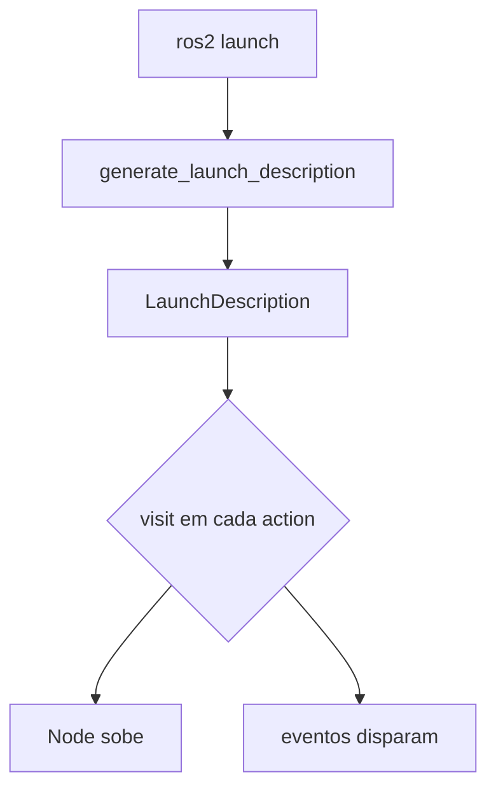

# Guia de formatos — o que dá para escrever aqui

Esta página é sua "folha de testes": um exemplo de cada recurso, com o fonte logo acima do resultado.

## Fórmulas LaTeX

Inline no meio do texto: a tartaruga gira para $\theta = \frac{\pi}{2}$ rad.

Bloco destacado (cinemática do robô diferencial):

$$
v = \frac{r(\omega_d + \omega_e)}{2}, \qquad
\omega = \frac{r(\omega_d - \omega_e)}{L}
$$

## Código com botão de copiar

```python
from launch import LaunchDescription
from launch_ros.actions import Node

def generate_launch_description():
    return LaunchDescription([
        Node(package='turtlesim', executable='turtlesim_node', name='sim'),
    ])
```

```bash
ros2 launch meu_pacote exemplo.launch.py
```

## Caixas (o equivalente das suas conceptbox)

!!! note "Conceito"
    `DeclareLaunchArgument` cria a caixinha; `LaunchConfiguration` cola o adesivo.

!!! warning "Armadilha"
    Esqueceu o `.items()` no `launch_arguments`? Erro confuso garantido.

??? tip "Dica recolhível (clique para abrir)"
    Use `--show-args` para listar os argumentos de qualquer launch file.

## Tabela

| Action | Dispara quando |
|---|---|
| `OnProcessStart` | o processo começa |
| `OnProcessExit`  | o processo morre |

## Diagrama Mermaid (substituto leve do TikZ)


